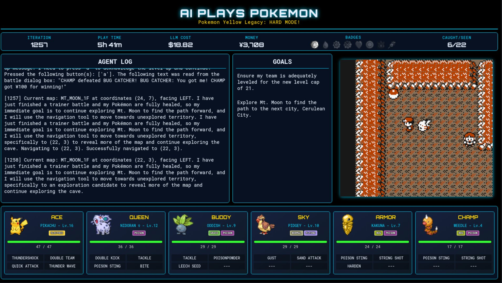

# AI Workflow for Pokémon Yellow Legacy: Hard Mode!

## Project Overview

This is a fully autonomous AI workflow designed to play [Pokémon Yellow Legacy](https://github.com/cRz-Shadows/Pokémon_Yellow_Legacy) on Hard Mode. Pokémon Yellow Legacy is a ROM hack of Pokémon Yellow that includes a ton of balance changes, quality of life improvements, and bug fixes, while maintaining the feel of the first generation of Pokémon. Hard mode adds level caps and blocks item use in battle, forcing the AI to strategize instead of winning by overlevelling a single Pokémon.

The AI workflow is written in Python and orchestrated by [Junjo](https://github.com/mdrideout/junjo), with custom logic for handling battles, navigating the overworld, and parsing text. It operates asynchronously with the [PyBoy emulator](https://github.com/Baekalfen/PyBoy), and is built to be modular and type-safe. The project aims to treat Pokémon as a client that can be served by a combination of classical algorithms (like A* search for navigation) with LLM powered decision making via the Google Gemini family of models.

Data from the AI workflow and the game's memory is piped into an HTML page for visualization, and the whole project is currently [streaming live on Twitch](link-to-stream). If you want to buy me a coffee to help cover the streaming costs, you can do so using the buttons below.

[paypal-button] [ko-fi-button]

If you want to learn more about how this all works, check out:
- [The philosophy behind the project](docs/philosophy.md)
- [A detailed look at the architecture](docs/architecture.md)
- [A node-by-node description of the AI workflow](docs/workflow.md)



## Installation and Setup

### Prerequisites

- Python 3.13
- [The uv package manager](https://docs.astral.sh/uv/) for installing dependencies
- The Pokémon Yellow Legacy ROM

### Installation

1. Clone this repository

2. Install the dependencies with `uv sync`

3. Set up your environment variables:
   Make a copy of the `.env.example` file and name it `.env`. You'll need to add a Gemini API key to get the LLM service to work. If you want to use [Jujno server](https://github.com/mdrideout/junjo-server) for telemetry, you'll have to create an API key for that as well.

**Note:** If you try to run the integration tests, many of them will fail because they depend on save states that I am not licensed to share.

## Running the Workflow

### Basic Usage

Run the AI workflow with the default settings using

```bash
python -m main
```

This will:
- Use the ROM at `resources/ylegacy.gbc` (default)
- Start a fresh game session
- Launch the live-updaing background display at `http://localhost:8080`
- Create automatic backups every 100 iterations

### Command Line Options

- `--rom-path PATH`: Specify a custom path to your ROM file
- `--backup-folder PATH`: Load a specific backup state
- `--load-latest`: Automatically load the most recent backup
- `--mute-sound`: Mute the emulator sound
- `--track-telemetry`: Enable telemetry tracking (requires Junjo server)

Other useful constants can be found (and edited) in `common/constants.py`.

### Backup and Restore

The system automatically creates backups every 100 iterations in the `outputs/` folder. Each backup contains the AI workflow state, the complete game state, and a copy of the SQLite database so that you can resume play from the moment the backup was taken. Crashes and manually exiting the emulator will also trigger a backup.

## FAQs

### Why Yellow Legacy?

Partly nostalgia since Pokémon Yellow was the first video game I ever played, but largely because its hard mode prevents the AI from winning by grinding a single Pokémon to level 100. I also think that the team behind Yellow Legacy basically perfected the Gen 1 experience and I wanted to highlight their excellent work.

### Didn't Gemini Plays Pokémon already do this?

Great minds think alike! This project, like [Gemini Plays Pokémon](https://www.twitch.tv/gemini_plays_Pokémon), was inspired by [Claude Plays Pokémon](https://www.twitch.tv/claudeplaysPokémon). I started working on an AI workflow for hard mode Yellow Legacy before I'd ever heard of Gemini Plays Pokémon, but that project did release first. Our approaches to the problem, however, are completely different from one-another's. For more on this, chcek out [my article on the philosophy behind this project](docs/philosophy.md).

### Why use Junjo over other frameworks?

Full disclosure: The creator of Junjo is a coworker and friend of mine. Personal sentiments aside though, Junjo prioritizes asynchronous execution and type safety with Pydantic, which I view as mandatory for any AI workflow. Many other orchestrators fail these criteria, or treat them as an afterthought. I also appreciate its lightweight, unopinionated design philosophy. It facilitates your work rather than imposing rigid abstractions that are challenging to edit or debug.

### Why are you using Gemini Flash instead of Pro?

I'm not made of money! Gemini Pro is 4x the price of Gemini Flash. It clearly outperformed Flash in my testing, obviously, but it cannot achieve its goals in 1/4th as many iterations, and is thus not worth the cost. It's also much slower than Flash, leading to a less smooth viewing experience. My only regret in using Flash is not being able to get away with using Flash-Lite instead! There is more discussion along these lines in [the philosophy article](docs/philosophy.md), but a big part of this project is the idea that a smaller model, properly orchestrated in modular, specific tasks, can dramatically outperform a larger model.

### Can it play other Pokémon games?

Not natively. You would have to create new parsers for the memory locations in whichever game you're trying to adapt it to, and probably tweak some of the timing and navigation logic, but it's certainly possible to adapt this to another Gen 1 or Gen 2 game. PyBoy, unfortunately, only runs GameBoy and GameBoy Color games, so you would need to find another solution to go beyond Gen 2.

### Do you intend to keep working on this?

I'd like to see it beat the game, and I'll try to support it so that it does (assuming the costs don't become too excessive first), but aside from that I think I'm done for now. I've been wanting to do some kind of "AI plays Pokémon" project for years, and I've had a ton of fun working on it, but I'd like to move on to some other projects now. 

### How much does it cost to run?

For a full 24 hour day of streaming to Twitch from a VM, you're looking at roughly (in USD): $70 for the LLM API calls, $3 for the VM itself, and $10 for network traffic. So around $85 per day in total.

### How fast does it play?

In my testing, it managed to beat Brock in just under five hours. This will fluctuate wildly depending on the decisions it makes in the early game, however.

## Licence & Affiliation Notice

All original source code in this repository is released under the [MIT Licence](LICENSE).

This is an unofficial, fan-made project, for educational purposes only. The code in this repository is designed to work with Pokémon games but does not include any ROMs, save states, or game sprites. Users are responsible for ensuring they own legitimate copies of Pokémon games and comply with all applicable laws and terms of service.

"Pokémon", Pokémon character names, and all related marks are owned by Nintendo, Game Freak, Creatures Inc., and The Pokémon Company. I am not affiliated with, endorsed, sponsored, or specifically approved by any of these entities.
