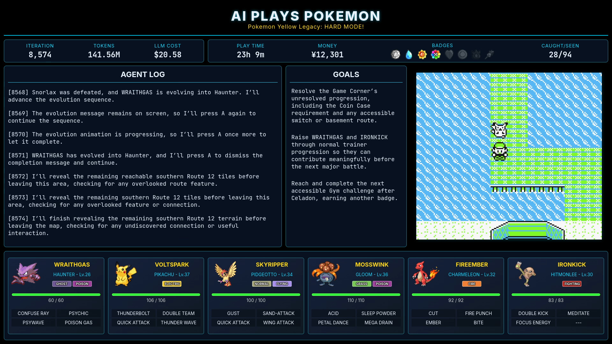

# AI Workflow for Pokémon Yellow Legacy: Hard Mode!

## Project Overview

This is a fully autonomous AI workflow designed to play [Pokémon Yellow Legacy](https://github.com/cRz-Shadows/Pokémon_Yellow_Legacy) on Hard Mode. Pokémon Yellow Legacy is a ROM hack of Pokémon Yellow that includes a ton of balance changes, quality of life improvements, and bug fixes, while maintaining the feel of the first generation of Pokémon. Hard mode adds level caps and blocks item use in battle, forcing the AI to strategize instead of winning by overlevelling a single Pokémon.

The AI workflow is written in Python and orchestrated by [Junjo](https://github.com/mdrideout/junjo), with custom logic for handling battles, navigating the overworld, and parsing text. It operates asynchronously with the [PyBoy emulator](https://github.com/Baekalfen/PyBoy), and is built to be modular and type-safe. The project aims to treat Pokémon as a client that can be served by a combination of classical algorithms and LLM powered decision making. It features a three-tier memory system with agent-guided long-term memory lookup from a SQLite database, and an ASCII map renderer with A* search navigation to help with the inherent limitations of working with LLMs.

Data from the AI workflow and the game's memory is piped into an HTML page for visualization, and the whole project was [streaming live on Twitch](https://www.twitch.tv/clambr0). The stream has been paused while I work on some improvements to the model's high-level navigation planning (and give my wallet some time to recover). Give me a follow on Twitch if you want to know when the stream is back!

If you want to learn more about how this all works, check out:
- [A deeper look into the philosophy and design of the project](docs/philosophy.md)
- [A node-by-node description of the AI workflow](docs/workflow.md)

If you want to buy me a coffee to help cover the streaming costs, you can do so using the button below.

<a href='https://ko-fi.com/H2H21JQ2I7' target='_blank'></a>



## Installation and Setup

### Prerequisites

- Python 3.14
- [The uv package manager](https://docs.astral.sh/uv/) for installing dependencies
- [An OpenAI API key](https://platform.openai.com/api-keys) for calling the LLM
- The Pokémon Yellow Legacy ROM — I am not licensed to distribute this. You'll have to get it yourself.

### Installation

1. Clone this repository

2. Install the dependencies with `uv sync`

3. Make a copy of the `.env.example` file and name it `.env`. Add your OpenAI API key there.

4. Put a compatible ROM at `resources/ylegacy.gbc`. If you build from the Yellow Legacy decomp, you can optionally apply [`pokeyellow.patch`](pokeyellow.patch) for two minor bug fixes.

5. (Strongly recommended) Add a [Logfire](https://logfire.pydantic.dev/) write
   token as `LOGFIRE_TOKEN`. Without telemetry, you will have very little
   visibility into what the agent is doing behind the scenes.

**Note:** If you try to run the integration tests, many of them will fail because they depend on save states that I am not licensed to distribute. Similarly, if you try to run the game state visualization server, you'll get an error that the sprites are unavailable for the same reason.

## Running the Workflow

### Basic Usage

Run the AI workflow with the default settings using

```bash
uv run python -m main
```

This will:
- Use the ROM at `resources/ylegacy.gbc` (default)
- Start a fresh game session
- Launch the live-updaing background display at `http://localhost:8080`
- Create automatic backups every 20 minutes
- Send telemetry to Logfire when `LOGFIRE_TOKEN` is configured

### Command Line Options

- `--rom-path PATH`: Specify a custom path to your ROM file
- `--backup-folder PATH`: Load a specific backup state
- `--load-latest`: Load the most recent backup (mutually exclusive with `--backup-folder`)
- `--mute-sound`: Mute the emulator sound

Other relevant constants can be edited in `common/constants.py`.

### Backup and Restore

The system automatically creates backups every 20 minutes in the `outputs/` folder. Each backup contains the AI workflow state, the game state, and a copy of the SQLite database so that you can resume play from the moment the backup was taken. Caught workflow errors also trigger a backup when the emulator remains available.

## FAQs

### Why Yellow Legacy?

Partly nostalgia since Pokémon Yellow was the first video game I ever played, but largely because its hard mode prevents the AI from winning by grinding a single Pokémon to level 100. I also think that the team behind Yellow Legacy basically perfected the Gen 1 experience and I wanted to highlight their excellent work.

### Didn't Gemini Plays Pokémon already do this?

Great minds think alike! This project, like [Gemini Plays Pokémon](https://www.twitch.tv/gemini_plays_Pokémon), was inspired by [Claude Plays Pokémon](https://www.twitch.tv/claudeplaysPokémon). I started working on an AI workflow for hard mode Yellow Legacy before I'd ever heard of Gemini Plays Pokémon, but that project did release before this one. Our approaches to the problem, however, are quite different. For more on this, check out [my article on the philosophy behind this project](docs/philosophy.md).

### What does the AI know?

Only what would be accessible to a human player. It can see the screen, and it has memories of the sprites and warps that it has seen in the past. It has no internet access, and the prompts do not contain any hints beyond basic play style. When battling Pokémon, it can only see the enemy's health as a percentage with a resolution that matches the resolution of the in-game health bar.

### Why use Junjo over other frameworks?

Full disclosure: The creator of Junjo is a coworker and friend of mine. Personal sentiments aside, Junjo prioritizes asynchronous execution and type safety with Pydantic, which I view as mandatory for any AI workflow. Many other orchestrators treat these criteria as an afterthought, or fail them altogether. I also appreciate Junjo's lightweight, unopinionated design philosophy. It facilitates your work rather than imposing rigid abstractions that are challenging to edit or debug.

### Why GPT-5.6 Luna?

It was the cheapest, fastest frontier model at the time of writing. My only regret is that they didn't offer an even cheaper option. There is more discussion in [the philosophy article](docs/philosophy.md), but a big part of this project is the idea that a smaller model, properly orchestrated to do specific tasks, can outperform a larger model. Smaller models also have lower latency, making for a more enjoyable viewing experience.

### Can it play other Pokémon games?

Not natively. You could adapt this code to another Gen 1 or Gen 2 game, but you would have to create new parsers for the memory locations in the new ROM, and probably tweak some of the timing and navigation logic. PyBoy, unfortunately, only runs GameBoy and GameBoy Color games, so you would need to find another emulator to go beyond Gen 2.

### Do you intend to keep working on this?

I'd like to see it beat the game, and I'll try to support it so that it does (assuming the cost doesn't become excessive), but aside from that I think I'm done for now. I've been wanting to do some kind of "AI plays Pokémon" project for years, and I've had a ton of fun working on this, but I'd like to move on to some other projects.

### How long did it take to build this?

[The first complete version](https://github.com/clambro/ai-plays-pokemon/tree/v1.0.0) took a good chunk of my free time for 2-3 months. The current version benefited from advances in vibe coding and was built on top of the first in about a week.

### How much does it cost to run?

Roughly $8 USD per hour for the Luna API calls.

### How fast does it play?

In my testing, it managed to beat Brock in just under five hours. This will fluctuate depending on the decisions it makes in the early game, however.

## Licence & Affiliation Notice

All original source code in this repository is released under the [MIT Licence](LICENSE).

This is an unofficial, fan-made project, for educational purposes only. The code in this repository is designed to work with Pokémon games but does not include any ROMs, save states, or game sprites. Users are responsible for ensuring they own legitimate copies of Pokémon games and comply with all applicable laws and terms of service.

"Pokémon", Pokémon character names, and all related marks are owned by Nintendo, Game Freak, Creatures Inc., and The Pokémon Company. I am not affiliated with, endorsed, sponsored, or specifically approved by any of these entities.
