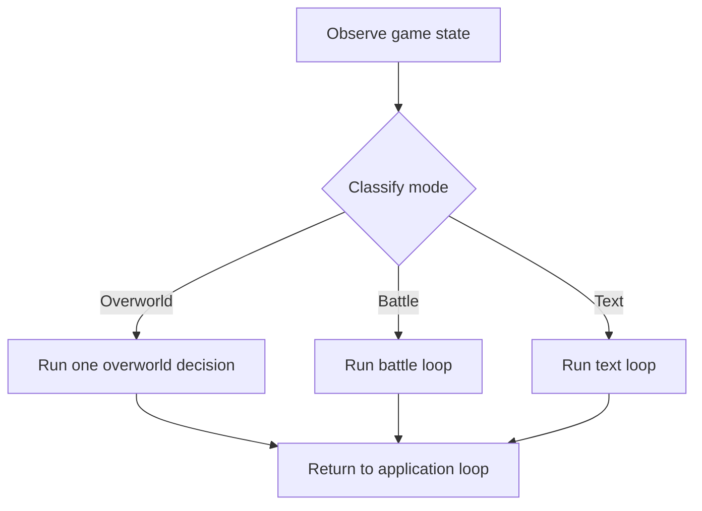

# Pydantic AI Migration Proposal v4

## Direction

Replace Junjo with three Pydantic AI agents and a small Pydantic Graph:

- overworld;
- battle; and
- text.

The architecture should make the agentic choices explicit and leave mechanical
gameplay in deterministic services. Each agent owns its context, prompt
preparation, tool registry, and execution policy.

Pydantic Graph is only the top-level mode router. It does not model every tool
call, button press, or step inside a battle or text interaction.

Long-term memory has already been simplified independently. The agent migration
depends on its title-based lookup rather than embedding retrieval.

## Execution Model

The application loop performs three operations:

1. Observe the current game state.
2. Determine the active mode.
3. Run the mode handler.

The mode handlers have different boundaries:

- Overworld prepares fresh context and runs one agent-selected action.
- Battle remains in a local observe-decide-act loop until battle mode ends.
- Text remains in a local observe-decide-act loop until the interaction ends.

Every decision is based on a fresh observation. A tool may perform substantial
deterministic work, such as following a route, but the next agent decision does
not reuse stale map, battle, menu, or player state.

If a tool changes the active mode, the current mode handler returns. The next
application-loop iteration observes the new state and routes accordingly.

## Dependency Inversion

Agent code must not depend directly on PyBoy, database repositories, the
streaming server, or other infrastructure implementations.

Keep stable application-facing boundaries around capabilities such as:

- reading game state;
- sending emulator input;
- navigating;
- reading and changing memory;
- reading and changing goals; and
- refreshing the background.

Concrete implementations are assembled in `agent/app.py`, which is the
composition root.

Dependencies point inward:

```text
infrastructure adapters
        ↓
application dependencies and mode contexts
        ↓
tool services
        ↓
Pydantic tool interfaces and agents
```

The Pydantic-facing interface is an adapter. It translates a validated model
tool call into an ordinary service call. The service contains the behavior and
receives its dependencies explicitly.

This separation means:

- agents do not receive a global container containing every application
  resource;
- services can be called without Pydantic AI;
- infrastructure can be replaced at the composition root;
- tool schemas can change without moving gameplay logic; and
- gameplay logic can change without changing how the model sees a tool.

Use functions for tool interfaces, services, context preparation, and
registries. Use classes only for stateful resources or where a type genuinely
improves the design.

## Agent Contexts

Each agent has its own dependency/context dataclass:

- `OverworldContext`;
- `BattleContext`; and
- `TextContext`.

Each is passed as that agent's `deps_type` and is accessed by tools through a
typed `RunContext`, for example `RunContext[BattleContext]`.

A mode context contains only:

- the prepared information needed for the current decision;
- the dependencies required by that mode's tools; and
- small mode-local state that must survive within its runner.

There is no shared all-purpose `AgentContext` and no mode agent receives the
root application's concrete dependencies.

Shared source data may be used to construct all three contexts, but the
resulting types remain separate. `prepare_overworld_context`,
`prepare_battle_context`, and `prepare_text_context` explicitly select what
each agent can see and use.

Internal contexts and state are dataclasses. Pydantic models are reserved for
validated tool arguments, tool results, serialized data, and other I/O
boundaries.

## Code Structure

```text
agent/
├── app.py
├── graph.py
├── state.py
├── overworld/
│   ├── agent.py
│   ├── context.py
│   ├── prepare.py
│   ├── run.py
│   └── tools/
│       ├── registry.py
│       ├── navigate/
│       │   ├── interface.py
│       │   ├── models.py
│       │   └── service.py
│       ├── press_buttons/
│       │   ├── interface.py
│       │   └── service.py
│       └── ...
├── battle/
│   ├── agent.py
│   ├── context.py
│   ├── prepare.py
│   ├── run.py
│   └── tools/
│       ├── registry.py
│       ├── fight/
│       │   ├── interface.py
│       │   ├── models.py
│       │   └── service.py
│       └── ...
└── text/
    ├── agent.py
    ├── context.py
    ├── prepare.py
    ├── run.py
    └── tools/
        ├── registry.py
        ├── press_buttons/
        │   ├── interface.py
        │   └── service.py
        └── ...
```

There is no `actions/` directory and no monolithic `tools.py`.

Every selectable tool has its own package. Its files have distinct jobs:

- `interface.py` defines the function exposed to Pydantic AI.
- `service.py` contains the deterministic business logic.
- `models.py` contains tool-specific boundary models when plain parameters and
  return types are insufficient.

The agent imports its registry. The registry imports tool interfaces. Tool
interfaces import their services. Agents do not import tool services directly.

Existing domain packages may continue to own lower-level parsing, pathfinding,
and emulator behavior. A tool service may compose those functions and
dependencies; it should not duplicate them.

## Pydantic AI Tool Construction

Pydantic AI function tools receive agent dependencies through
`RunContext[ContextType]`. Every tool interface therefore has the shape:

```python
async def navigate(
    ctx: RunContext[OverworldContext],
    destination: NavigationDestination,
) -> NavigationResult:
    """Navigate to a known destination.

    Args:
        destination: The known map location or entity to reach.
    """
    return await navigate_service(
        context=ctx.deps,
        destination=destination,
    )
```

`interface.py` is the only part of this tool that imports `RunContext`.
`service.py` knows nothing about Pydantic AI.

Google-style docstrings and type annotations define the description and JSON
schema shown to the model. Tool-specific Pydantic models validate structured
arguments and results at this boundary.

### Tool registries

Each agent owns one `tools/registry.py`. The registry builds a Pydantic AI
`FunctionToolset` from the interface functions belonging to that agent.

Conceptually:

```python
toolset = FunctionToolset[OverworldContext](
    tools=[
        navigate,
        press_buttons,
        use_item,
        update_goals,
        update_memory,
    ],
)
```

The registry is composition, not dispatch. Pydantic AI still inspects and
executes the actual interface functions. There is no application-defined
`tool_name -> handler` switch and no second model response that is converted
into a tool call elsewhere.

Where tool legality changes with state, wrap the registered toolset with
Pydantic AI's `FilteredToolset` or `.filtered(...)`. The filter reads the typed
mode context and the Pydantic `ToolDefinition` before each model step. Tool
interfaces still validate state-dependent arguments because exposure alone
cannot prove that a particular target remains valid.

Do not build a custom `AbstractToolset` unless `FunctionToolset` composition
and filtering prove insufficient.

### Decision execution

An agent call must use real function tools. It must not return an action enum,
tool name, or arguments for application code to dispatch.

The mode runner owns how long an agent run is allowed to continue:

- ordinary `Agent.run()` is appropriate when the model should receive a tool
  result and continue reasoning;
- `Agent.iter()` is the supported lower-level API when the runner should stop
  immediately after one function-tool execution; and
- Pydantic usage limits and disabled parallel tool calls can enforce a
  one-action decision where required.

This policy is decided per mode without changing tool architecture. A
single-step agent still selects and executes an actual Pydantic AI function
tool.

## Root Graph

The root Pydantic Graph stays deliberately small:



Its responsibilities are limited to observing enough state to classify the
mode and invoking the correct runner. Each runner prepares its own context.

The graph does not own tools, prompts, memory mutation, background updates, or
the internal battle and text loops.

### Iteration semantics follow-up

Preserve the existing Junjo iteration behavior during the mode migrations
because it is tightly coupled to agent state, rolling-memory finalization, and
SQLite persistence. This temporarily means one overworld action advances the
iteration while an entire battle or text loop shares one iteration.

After the root graph migration is complete, revisit this boundary. Advancing
the iteration for each agent-loop decision may provide a cleaner and more
consistent definition across all three modes, but it should be changed together
with the memory and database lifecycle rather than inside an individual mode
migration.

## Overworld Agent

The overworld runner prepares `OverworldContext`, supplies the overworld
registry, and runs one agent-selected action.

Its tools cover capabilities such as:

- navigation;
- direct interaction or constrained button input;
- item and party management;
- the Sokoban solver;
- goal changes;
- long-term-memory changes; and
- map annotations.

The context includes the current explored map, provisional connected regions,
known transitions, player and party state, relevant memory and goals, and the
current screenshot.

Navigation remains a real agent tool. Its interface accepts a semantic,
validated destination. Its service owns pathfinding, emulator movement,
interruption handling, observation updates, and progress reporting.

Goal and long-term-memory mutation are ordinary overworld tools. They do not
run as periodic root-graph jobs.

## Battle Agent

The battle runner owns a local loop:

1. Observe settled battle state.
2. Prepare a new `BattleContext`.
3. Filter the battle registry to legal tools.
4. Run one battle-agent decision.
5. Re-observe the game.
6. Repeat until battle mode exits.

Battle tools include fighting, switching, throwing a ball, running, and
constrained input for irregular screens.

Each tool has its own interface and service package. The interface presents
semantic choices to the model. The service translates the choice into known
game inputs and returns the observed result.

The root graph is not re-entered between battle actions.

## Text Agent

The text runner also owns a local loop. Plain dialog advancement remains
deterministic when no decision is required. Menus, questions, naming screens,
and irregular interactions use the text agent and its registered tools.

Each iteration:

1. Observe the current text state.
2. Exit if the interaction has ended.
3. Advance plain dialog deterministically when safe.
4. Otherwise prepare a new `TextContext`.
5. Run one text-agent tool decision.
6. Re-observe before continuing.

Initial text tools are constrained button input and name entry. Additional
tools should be introduced only when they represent a distinct semantic
capability.

The root graph is not re-entered between text decisions.

## Deterministic Responsibilities

Ordinary code remains responsible for:

- parsing game state;
- classifying the active mode;
- preparing each mode context;
- calculating tool legality;
- validating state-dependent tool arguments;
- emulator input sequences;
- navigation and pathfinding;
- updating explored map geometry;
- recognizing battle and text termination;
- safely advancing plain dialog; and
- refreshing the background.

Agents choose actions, targets, responses, and plans. They do not reproduce
mechanics already known to the application.

## HTML Background

Background rendering remains behind a small application-facing boundary
implemented by the existing streaming infrastructure.

Mode runners refresh at mode entry and exit. Tool services refresh after
material state changes and during long deterministic operations when the
display would otherwise become stale.

The background server is injected by the composition root. Agent contexts and
tool services do not depend on the concrete server. Memory and game-state
models do not know about rendering.

This keeps the existing polling UI synchronized while battle and text remain
inside their local loops.

## Long-Term Memory Boundary

The simplified long-term-memory implementation exposes a narrow
application-facing boundary:

- list available memory titles;
- load durable memory by title;
- create or revise a memory; and
- persist changes.

Agent contexts and tool services use this boundary. They do not depend on
embedding or reranking details.

## Migration Phases

Each phase is implemented separately and leaves the application working.

### Phase 1: Replace the battle subflow

- Introduce `BattleContext`, its preparation function, battle agent, tool
  registry, and per-tool interface/service packages.
- Implement the local battle loop.
- Replace the Junjo battle subflow with one temporary adapter that invokes the
  complete battle runner.
- Remove the superseded battle graph and nodes.

### Phase 2: Replace the text subflow

- Introduce `TextContext`, its preparation function, text agent, tool
  registry, and per-tool interface/service packages.
- Implement the local text loop.
- Replace the Junjo text subflow with one temporary adapter that invokes the
  complete text runner.
- Remove the superseded text graph and nodes.

### Phase 3: Replace the overworld subflow

- Introduce `OverworldContext`, its preparation function, overworld agent,
  tool registry, and per-tool interface/service packages.
- Run one actual agent tool decision per overworld turn.
- Move goal and durable-memory changes into overworld tools.
- Replace the Junjo overworld subflow with one temporary adapter that invokes
  the overworld runner.
- Remove the superseded selector prompts, secondary argument prompts, graph,
  and nodes.

### Phase 4: Replace the root graph

- Implement the small functional Pydantic Graph.
- Route directly to the three completed mode runners.
- Make `agent/app.py` the composition root for concrete adapters and
  mode-context factories.
- Remove the temporary adapters and all remaining Junjo code.

## Pydantic AI References

- [Dependencies and typed `RunContext`](https://pydantic.dev/docs/ai/core-concepts/dependencies/)
- [Function tools and generated schemas](https://pydantic.dev/docs/ai/tools-toolsets/tools/)
- [`FunctionToolset` and toolset filtering](https://pydantic.dev/docs/ai/tools-toolsets/toolsets/)
- [Agent execution and iteration](https://pydantic.dev/docs/ai/core-concepts/agent/)
- [Pydantic Graph](https://pydantic.dev/docs/ai/graph/)
