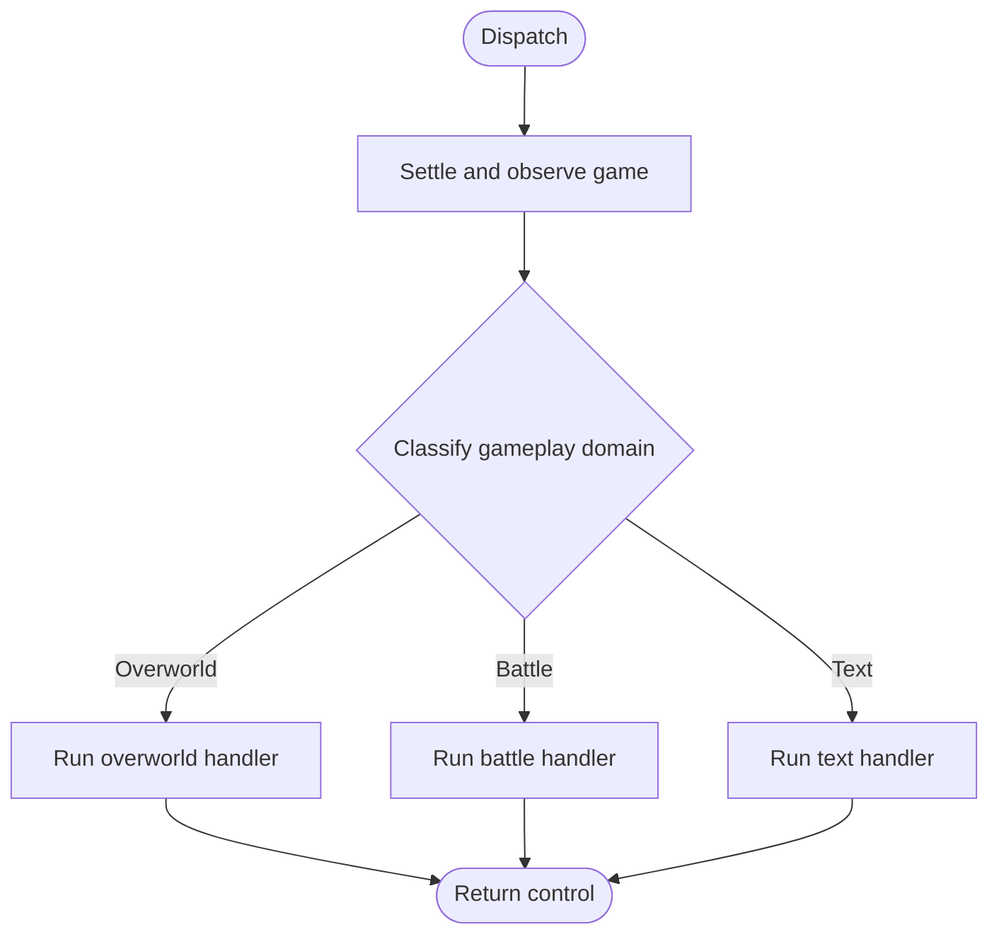

# Ticket: Remove the Junjo Root and Centralize Agent Orchestration

## Context

This is the final implementation ticket in
[`PYDANTIC_AI_MIGRATION_PROPOSAL.md`](PYDANTIC_AI_MIGRATION_PROPOSAL.md). The
first four phases are complete: overworld, battle, and text are Pydantic AI
agents, and long-term memory and goals are overworld tools. Junjo now provides
only routing and iteration bookkeeping around those agents.

The parent proposal assumed that the Junjo root would be replaced by Pydantic
Graph. That is no longer the default. Once iteration bookkeeping and display
refreshes move to the agents, the remaining root behavior is a deterministic
three-way selection followed by one function call. A graph library would add
structure without expressing a meaningful graph.

The replacement should center the agents:

- all three agents operate through one shared application context;
- one ordinary typed orchestrator selects the handler responsible for the
  current gameplay domain;
- shared agent execution publishes the background immediately before tool
  calls; and
- the handlers own rolling-memory iteration boundaries.

Where this ticket conflicts with the parent proposal's separate mode contexts,
iteration-oriented root graph, or required Pydantic Graph migration, this
ticket is the current design.

## Outcome

Remove Junjo completely and replace its root workflow with a small typed
orchestration function around the three Pydantic AI handlers.

Conceptually:

This is ordinary control flow, implemented with typed functions and a
deterministic branch. There are no orchestration objects or stages for
preparing an iteration, refreshing the HTML background, or finalizing memory.

Pydantic Graph should be introduced only if implementation uncovers a real
need for graph semantics, such as multiple non-trivial cycles, concurrent
branches and joins, durable resumability at internal nodes, or external control
over suspended execution. A deterministic three-way router does not meet that
threshold.

## Shared Agent Context

Replace `OverworldContext`, `BattleContext`, and `TextContext` with one
standard-library dataclass shared by the orchestrator, all three Pydantic AI
agents, and their tools. Conceptually it owns:

- the mutable `AgentState`; and
- the running emulator.

The same context instance survives domain transitions for the lifetime of the
running application. All three agents use `AgentContext` as their `deps_type`,
and every toolset is parameterized by that same concrete type. New
orchestration code must not use `typing.Any`, unparameterized framework types,
or casts to erase incompatible dependencies.

Mode-specific prepared data does not need a separate agent context or wrapper
model. The overworld handler prepares its current map and available
long-term-memory titles as ordinary run-local values. Prompt and tool builders
receive only the values they use or close over them for that run. They are not
stored as optional fields on the shared context, and battle and text do not
receive irrelevant overworld state.

`AgentState` remains the serializable backup model in this ticket. Replace its
Junjo `BaseState` parent with Pydantic `BaseModel`; the broader conversion of
internal models belongs to the model-boundary follow-up.

## Central Agent Execution

Once every agent has the same dependency type, replace the three duplicated
`Agent.iter()` loops with one fully typed supervisor. Mode handlers remain
responsible for constructing their agent, initial input, and fixed toolset,
then pass those to the supervisor with a typed exit policy.

The supervisor owns the behavior common to every model turn:

1. account for each model response exactly once;
2. append ordinary-text reasoning to the active rolling-memory block;
3. capture the freshest game state and publish the background;
4. execute the selected function tool; and
5. stop or continue according to the active handler's exit policy.

Publication happens after the model has explained its decision and immediately
before its tool executes. The viewer therefore sees the current state, token
totals, goals, memory, and intended action before the emulator changes. Remove
the display-only root node and remove ordinary background-publication side
effects from tool-result helpers and rolling-memory domain objects.

Deterministic actions outside a model turn follow the same rule. In particular,
the text handler publishes before advancing plain dialog. A long deterministic
service may publish intermediate progress through the existing background
helper when useful, but background publication is never an orchestration stage.

Mode-specific behavior remains explicit:

- **Overworld** prepares its map observation and conditional toolset, and
  returns after movement, a map change, or a transition into text or battle.
- **Battle** prepares its battle-type toolset and keeps one conversation alive
  until battle mode exits.
- **Text** drains ordinary dialog deterministically, constructs an agent only
  when a decision remains, and returns when text mode exits or battle begins.

## Agent-Owned Iterations

The orchestrator should not define an "application iteration." Iteration is
rolling-memory lifecycle metadata owned by each handler.

Preserve the current semantic boundary initially: one complete handler
activation produces one rolling-memory iteration, even when that handler makes
several tool calls. Each handler should enter a shared, typed iteration
lifecycle around its own work. That lifecycle:

1. initializes the active rolling-memory block;
2. updates `AgentState.iteration` from that block;
3. clears loaded long-term-memory context only when the iteration advances;
4. lets the handler run; and
5. persists and compacts the completed block when the handler returns.

The lifecycle implementation may be shared, but the handler invokes it. It is
not wrapped around the handler by the root orchestrator. Text-only deterministic
interactions remain handler activations and retain their existing iteration
behavior.

The active agent conversation remains independent of this bookkeeping. Tool
results enter the conversation normally, retrieved long-term memory remains
available to later turns in that conversation, and static instructions and tool
definitions remain cacheable.

`AgentStore` is no longer needed. Bind usage accounting directly to the shared
context's active state and keep the update operation task-safe without
recreating a general-purpose state container.

## Typed Root Orchestration

The root becomes one ordinary async function. It should:

1. wait twice for animations to settle;
2. read the current game state;
3. classify it as overworld, battle, or text; and
4. invoke the corresponding handler with the shared `AgentContext`.

Classification remains deterministic and preserves:

- the post-catch nickname-screen exception, which routes to text even while
  the game still reports battle state; and
- the zero-sized-map fallback used during cutscene transitions.

The orchestrator does not know whether the selected handler makes zero, one,
or many model calls or tool calls. It does not read or update the iteration
counter, publish the background, finalize memory, construct agents, or catch
mode-specific execution failures.

Keep the outer loop in `main.py`. It already owns emulator and stream-server
lifetimes, backup scheduling, and recovery. `agent/app.py` constructs one
shared context from those live resources, and the loop repeatedly dispatches
through the typed orchestrator. Turning the dispatcher into its own permanent
loop would require moving periodic backups and shutdown recovery into separate
concurrent services; that is independent of Junjo removal.

## Staged Plan

### Stage 1: Introduce the shared context

- Add the concrete `AgentContext` shared by every gameplay agent.
- Migrate overworld, battle, text, and every tool registry to the shared
  Pydantic AI dependency type.
- Extract mode-specific prepared data from the old context classes and pass
  each value explicitly to the prompt and tool builders that use it.
- Keep the existing Junjo adapters temporarily so this structural change can
  be reviewed independently.
- Do not introduce dependency-erasing types or a bag of optional mode data.

### Stage 2: Centralize agent and iteration lifecycles

- Replace the three duplicated `Agent.iter()` loops with one supervisor using
  the shared context.
- Move usage accounting, reasoning capture, pre-tool publication, and common
  model-run cleanup into that supervisor.
- Give each handler ownership of the shared rolling-memory lifecycle and
  iteration update around its activation.
- Remove publication from ordinary tool-result helpers and from
  `RollingMemory.add_memory`.
- Preserve handler boundaries, agent conversations, prompts, tool results, and
  cache behavior.

The temporary Junjo path may need a narrow compatibility adapter during this
stage, but Junjo must no longer own iteration state.

### Stage 3: Cut over to typed orchestration

- Implement the deterministic classifier and typed three-handler dispatcher.
- Change `agent/app.py` and `main.py` to keep one shared context alive across
  repeated dispatches.
- Replace `AgentState(BaseState)` with `AgentState(BaseModel)` and remove
  `AgentStore` and the persisted `handler` field.
- Delete the Junjo graph, conditions, prepare/finalize/background nodes, and
  temporary mode adapters.
- Remove the Junjo dependency and refresh the lockfile so Junjo-only transitive
  packages disappear.
- Preserve backup JSON behavior and the existing outer backup loop.

Do not add Pydantic Graph during this stage unless a concrete requirement from
the threshold above has appeared and is documented first.

### Stage 4: Remove migration residue

- Move the mode packages from `agent/subflows/*_handler` to
  `agent/{overworld,battle,text}` in a separate mechanical change.
- Delete the Junjo visualization script and generated DOT, SVG, and HTML
  assets; a three-way function does not need a generated workflow diagram.
- Update `docs/workflow.md`, `AGENTS.md`, and the parent migration proposal to
  describe the shared context, agent-owned iterations, and typed dispatcher.
- Retire completed migration tickets and rename the model-boundary follow-up so
  active paths no longer carry Junjo terminology.
- Verify that no Junjo import, dependency, adapter, asset, or active
  documentation reference remains.

## Test Strategy

Protect observable behavior and lifecycle rules rather than internal dispatch
wiring.

- Classification tests cover overworld, battle, text, naming screens, and
  zero-sized transition maps.
- Shared-context coverage proves state written by one handler is visible to the
  next handler without conversion or copying.
- Supervisor tests cover response accounting, reasoning capture, publication
  before tool execution, handler-directed termination, and error cleanup
  without live model calls.
- Handler-lifecycle tests cover memory initialization, iteration updates,
  long-term-memory clearing, and finalization for all three modes, including
  text interactions that require no model call.
- Orchestrator integration tests prove each classified domain invokes only its
  corresponding handler and returns control to the application loop.
- Backup coverage proves the updated `AgentState` still round-trips through the
  existing JSON format.
- Existing mode and tool tests continue to protect gameplay behavior.

Do not test exact branch syntax, internal helper call sequences, or generated
diagram contents.

## Completion Criteria

- All three Pydantic AI agents and all tools use the same concrete
  `AgentContext` dependency type.
- New orchestration code contains no `typing.Any`, unparameterized framework
  generics, dependency-erasing casts, or universal optional mode state.
- One shared supervisor owns response accounting, reasoning capture, pre-tool
  background publication, tool execution, and mode termination.
- Handlers own rolling-memory initialization, iteration updates, loaded-memory
  clearing, and finalization; root orchestration does not represent or perform
  those operations.
- The root is an ordinary typed classifier and three-handler dispatcher unless
  a concrete graph requirement is documented during implementation.
- `AgentStore`, the persisted handler field, temporary adapters, and every
  Junjo graph or node are gone.
- Junjo is absent from project dependencies and the lockfile.
- Active code, tests, documentation, and generated assets contain no remaining
  Junjo references.
- Overworld, battle, text, cross-mode transitions, deterministic text handling,
  background publication, usage accounting, shutdown, and backup recovery
  retain their intended behavior.
- Static checks and the complete non-live test suite pass.

## Open Questions

1. **Iteration granularity:** The proposal moves the existing one-handler-per-
   iteration behavior into the handlers. Should this ticket instead redefine
   an iteration as one model-selected tool action? That would be a larger
   rolling-memory semantic change, particularly for retrieved memory that must
   remain loaded across several turns in one overworld conversation.
2. **Permanent dispatcher:** Should the orchestrator return after one handler
   activation and leave backups in the existing outer loop, as proposed, or
   should this ticket also create a permanent domain-to-domain loop and move
   backup scheduling out of `main.py`?
3. **Unexpected failures:** Should the shared agent lifecycle recover from
   known `AgentRunError` failures but propagate unexpected exceptions to
   `main.py` for backup and shutdown? That is the proposed default; the current
   battle and text adapters instead swallow every exception.
