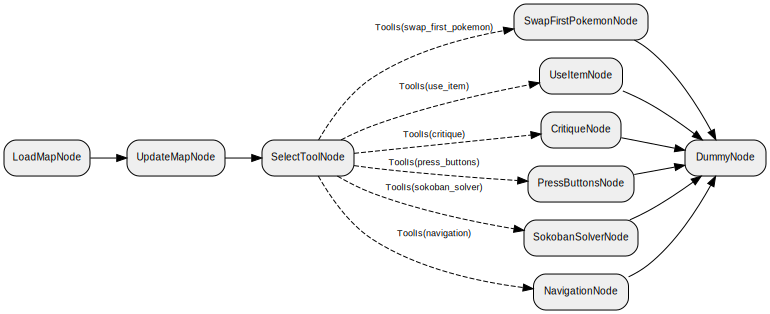
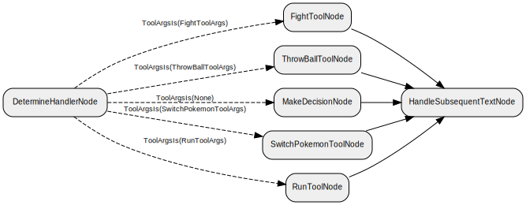
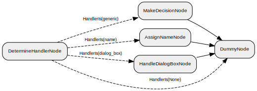

# AI Workflow: Node-by-Node Analysis

This page will walk in detail through the entire Junjo workflow, one node at a time. You might want to [familiarize yourself with the architecture](/docs/architecture.md) before diving into this, as some of that terminology will be used here. At a high level, we have a top-level entrypoint for the agent that handles memory updates and retrieval, setting goals, and routes the flow to one of three dedicated subgraphs, each of which handles a major aspect of playing Pokemon. The three subgraphs are the Overworld Handler, the Battle Handler, and the Text Handler, and each one has its own suite of tools to operate in its domain.

## The Main Agent Graph

### Prepare Agent Store

This is the entrypoint for the entire AI workflow. It is responsible for taking the previous agent state and preparing for the next iteration of the loop. It increments certain counters, waits for any in-game animations to finish, and determines which subflow the workflow will route to depending on whether the current game state is in a battle, free to move in the overworld, or reading dialog/menu text.

### Create/Update Long-Term Memory

These are two nodes that run in parallel if the Prepare Agent Store node determines that a refresh of the long-term memory is required. They do exactly what the name suggests: One creates new long-term memory objects in the database, and the other updates the ones that are currently in memory.

### Retrieve Long-Term Memory

This is the node that pulls long-term memories from the database. It first constructs a query based on the current game state, embeds the query, and compares it via cosine similarity to the memories in the database. The top few memories are then re-ranked by a combination of cosine similarity to the query, recency, and importance. The top N by that combined score then get added to the agent state until the next retrieval iteration.

### Dummy Node

This is purely topological to simplify the flow of the graph. It does nothing.

### The Three Subflows

At this point, the flow is diverted into one of the three subflows. Each of these is treated fully below.

### Do Updates

This is another collection of parallel nodes, each of which runs every few iterations depending on the constants in [`common/constants.py`](/common/constants.py). They're all pretty self-explanatory:
- Update Goals: Optionally sets/edits/completes the AI's goals
- Update Summary Memory: Optionally adds new memories to the summary memory, and thus bumps off old, irrelevant ones
- Update Background Stream: Updates the live background for streaming at `localhost:8080` with the latest information from the workflow and game states

### Save Game State

The final state in the workflow. This one's only job is to capture the save state of the emulator and add it to the agent workflow state so that we can use it for testing, backups, and disaster recovery. After this node is run, the whole workflow starts over again.

## The Overworld Handler Subflow

### Load Map

This is the entrypoint for the overworld handler. It loads the current map from the database into the agent state, or creates a new one if we've just entered a new map.

### Update Map

This uses the current visible screen information to update the map memory in the database. It updates the tiles, revealing any formerly unseen tiles that are now visible, and adds on-screen sprites/signs/warps to the map entity database table.

### Select Tool

This is the main decision maker in the overworld subflow. It looks at the game state and the various memory objects and selects which tool the AI should use for this iteration. The tools are all described in detail below. Whatever raw memory "thought" the AI creates in this node is continued by whichever tool is selected.

### Press Buttons

This is the simplest of all the overworld tools, and it does exactly what it says on the tin: It allows the AI to enter one or more button presses directly into the emulator. Its main use case is for interacting with an adjacent entity using the A button, but it can also be used to rotate the player in place, open the start menu, find wild Pokemon by spinning around, or walk a few steps, though the AI is strongly discouraged from using this tool to navigate around the map. This is partly because it's a waste of tokens to move this way when the navigation tool is available, but largely because it has awful spatial reasoning and cannot be trusted to move around effectively on its own.

### Navigation

This is the main tool used for navigating the overworld, and also by far the most complex node in the entire workflow. The AI is given a list of accessible tiles, as well as some good candidates for further exploring the map (walkable tiles next to unseen tiles), and it tells the tool where it wants to go. The destination is checked to make sure it's legal, and an A* algorithm then finds the shortest path and starts walking there. Every step, it checks for interruptions (e.g. battles, or randomly moving sprites that block the path). The navigation algorithm is sophisticated enough to handle ledges, surfing, cut trees, and elevation changes in caverns.

### Critique

The critique tool is the only instance in the entire workflow where Gemini Pro is used. If the AI feels completely stuck, it can (at most once every 20 iterations) invoke Gemini Pro to get some advice on how to get unstuck. This is extremely helpful for breaking the model out of weird loops, although we do have to be careful: Sometimes the critic's advice is wrong!

### Use Item

Exactly what it says on the tin: The AI can select an item from its bag and attempt to use it.

### Swap First Pokemon

This is a niche tool that lets the model swap its first Pokemon with another Pokemon in the party. It's useful for training specific Pokemon, or leading with certain Pokemon before major battles.

### Sokoban Solver

This was my least-favourite node to code in the whole workflow because it is so complicated and we only need it in exactly two areas in the game, one of which is optional. "Sokoban" puzzles, named for the classic Japanese video game that popularized them, are the style of puzzles that appear in Pokemon as the boulder pushing puzzles in Victory Road and the Seafoam Islands. There is no way that the AI is solving these on its own, so we need an algorithm to do it. Sokoban puzzles are NP-hard problems, but thankfully the ones found in-game are simple enough to be solved quickly with A* search.

### Dummy Node

Purely topological, as are all dummy nodes in the workflow. This is the sink node the signals the end of the overworld subflow.

## The Battle Handler Subflow

## The Text Handler Subflow

