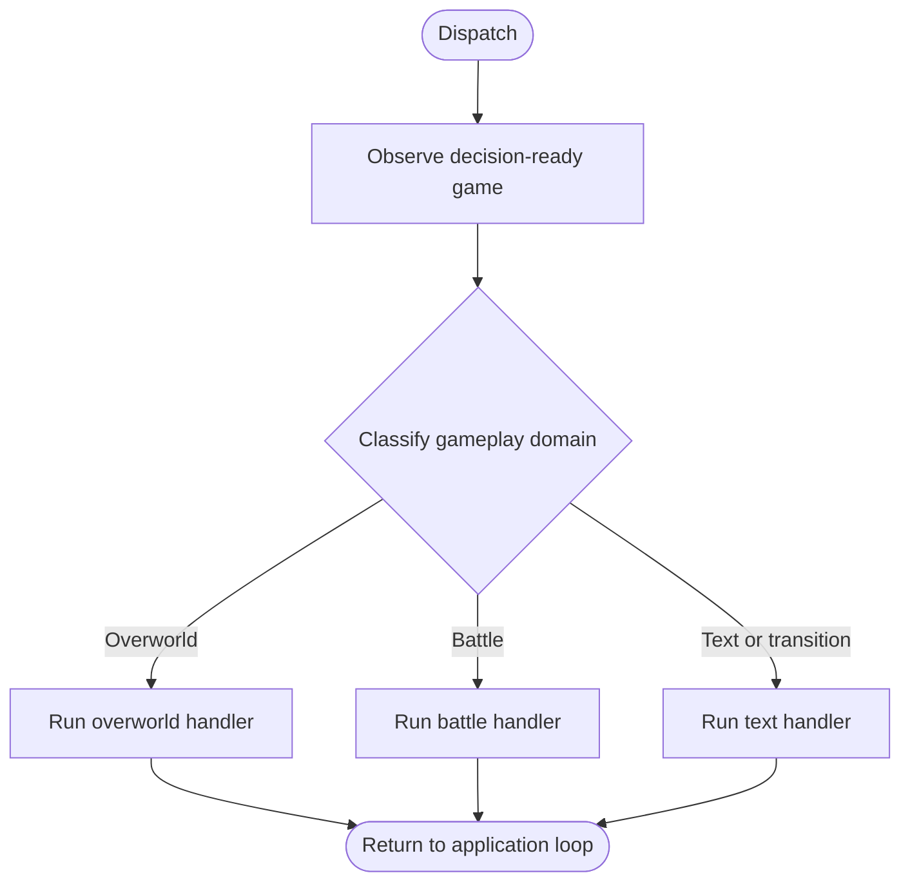
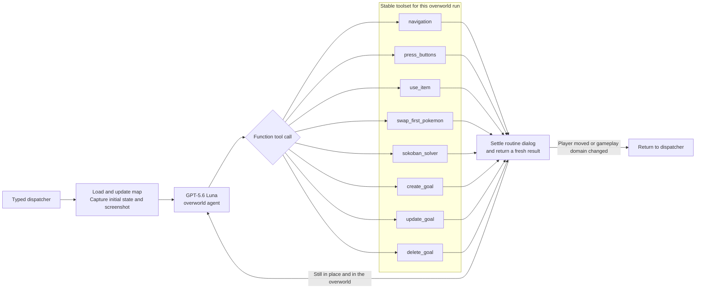
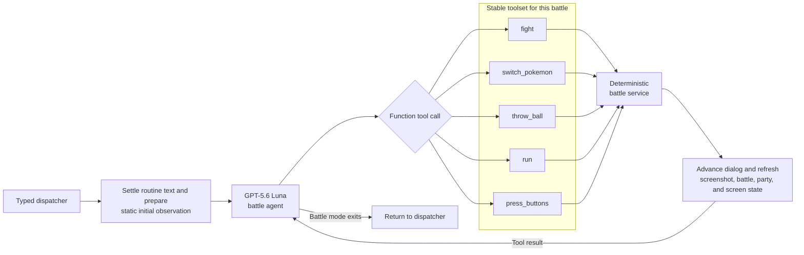
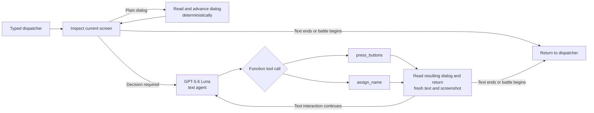

# AI Workflow Architecture

This page describes the current gameplay-agent workflow. You might want to [familiarize yourself with the design of the project](/docs/philosophy.md) before diving in, as some of that terminology is used here. One shared application context connects a typed dispatcher to the overworld, battle, and text handlers. Each handler owns its Pydantic AI conversation and rolling-memory lifecycle.

Note: Pretty much all the constants below are default values that can be edited in [`common/constants.py`](/common/constants.py).

## Top-Level Orchestration

`main.py` creates one `AgentContext` containing the mutable `AgentState` and the running emulator. The same context instance survives every gameplay-domain transition. Startup or restoration first waits until the game is ready for an external decision. Thereafter, tools and deterministic handlers return at that same boundary, so each dispatcher pass can read the current game state and select exactly one handler:

```mermaid
flowchart TD
    dispatch([Dispatch]) --> observe[Observe decision-ready game]
    observe --> classify{Classify gameplay domain}
    classify -->|Overworld| overworld[Run overworld handler]
    classify -->|Battle| battle[Run battle handler]
    classify -->|Text or transition| text[Run text handler]
    overworld --> return([Return to application loop])
    battle --> return
    text --> return
```

Battle takes precedence except on the post-catch naming screen, which belongs to the text handler. Visible text and zero-sized transition maps also route to text; all other states route to overworld. The dispatcher does not construct agents, manage memory, publish the background, or interpret tool calls.

### Iterations

An iteration represents one gameplay decision attempt and any durable outcome. Deterministic work can also produce an iteration when it records meaningful activity.

Handlers can complete several iterations while keeping one Pydantic AI conversation alive, preserving context across related decisions.

### Shared Agent Runtime

Pydantic AI hooks account for every model response, append ordinary-text reasoning to the active rolling-memory block, and publish completed decisions before their actions begin. After an action finishes, shared dialog settlement publishes its complete transcript and terminal game state. Tools return the same terminal observation to the local conversation.

The application loop owns emulator and streaming-server lifetimes. It captures the emulator state and creates a backup every 10 minutes and after an unexpected handler failure. The copied SQLite database contains finalized memory history, while serialized `AgentState` contains the remaining live application state and totals. Rolling memory is rebuilt from the copied database rather than serialized into `AgentState`.

### Model Boundaries

Pydantic models represent values that cross validation or serialization
boundaries. This includes raw-ROM parser outputs, coordinates, live
`AgentState`, database DTOs, Pydantic AI tool inputs, streaming responses, and
settings. Standard-library dataclasses represent trusted internal aggregates
such as `GameState`, rolling memory, goals, explored
maps, and solver state. Loading a backup validates `AgentState` directly, then
the next handler reconstructs rolling memory from SQLite.

## The Overworld Agent

The overworld handler prepares the explored map and then gives one Pydantic AI agent the local navigation loop. The runner returns to the dispatcher as soon as a tool moves the player or the game enters another gameplay domain.

```mermaid
flowchart LR
    dispatch["Typed dispatcher"] --> prepare["Load and update map<br/>Capture initial state and screenshot"]
    prepare --> agent["GPT-5.6 Luna<br/>overworld agent"]
    agent --> choice{"Function tool call"}

    subgraph toolset["Stable toolset for this overworld run"]
        navigate["navigation"]
        buttons["press_buttons"]
        item["use_item"]
        swap["swap_first_pokemon"]
        sokoban["sokoban_solver"]
        create_goal["create_goal"]
        update_goal["update_goal"]
        delete_goal["delete_goal"]
    end

    choice --> navigate
    choice --> buttons
    choice --> item
    choice --> swap
    choice --> sokoban
    choice --> create_goal
    choice --> update_goal
    choice --> delete_goal

    navigate --> observe["Settle routine dialog<br/>and return a fresh result"]
    buttons --> observe
    item --> observe
    swap --> observe
    sokoban --> observe
    create_goal --> observe
    update_goal --> observe
    delete_goal --> observe

    observe -->|"Still in place and in the overworld"| agent
    observe -->|"Player moved or gameplay domain changed"| finish["Return to dispatcher"]
```

### Prepare Context

Before constructing the agent, deterministic preparation loads the current explored terrain from SQLite or creates it when entering a new map. The current visible screen reveals only entity-free terrain while separately synchronizing discovered sprite, sign, and warp identities. The prompt composes those discoveries with live emulator positions, including the player and Pikachu, without writing any overlays back into terrain. It shows sprites in the current reachable region plus sprites the ROM permits the player to interact with across a counter, together with the reachable interaction position. The prepared context, initial game state, and screenshot are then used to build one static prompt and tool registry for the run.

The prompt includes rolling memory, goals, player and party state, inventory indices, the explored map, exploration candidates, and accessible connected-map boundaries.

Tool availability is derived once from the prepared state:

- `press_buttons` and the three goal lifecycle tools are always available;
- `navigation` is unavailable while biking;
- `swap_first_pokemon` requires more than one party member;
- `use_item` requires a non-empty inventory;
- `sokoban_solver` requires a visible boulder and goal plus access to Strength.

Keeping the registry fixed preserves prompt caching. Actions that depend on changing game state validate what they need immediately before acting rather than rebuilding the tool definitions during the run.

### Press Buttons

This is the simplest of all the overworld tools, and it does exactly what it says: It allows the AI to enter one or more button presses directly into the emulator. Its main use case is for interacting with an adjacent entity using the A button, but it can also be used to rotate the player in place, open the start menu, or walk a few steps, though the AI is strongly discouraged from using this tool to navigate around the map. This is partly because it's a waste of tokens to move this way when the navigation tool is available, but largely because it has awful spatial reasoning and cannot be trusted to move around effectively on its own.

### Navigation

This is the main tool used for navigating the overworld, and also the most complex deterministic service in the workflow. The AI chooses a revealed destination from the explored map, aided by exploration candidates and accessible connected-map boundaries. Each route is derived from stable terrain plus discovered structural tiles and currently rendered blocking sprites, so old sprite positions cannot become permanent obstacles. The tool rejects inaccessible destinations, and an A* algorithm finds the shortest path and starts walking there. Every step, it checks for interruptions and updates the terrain and discoveries. The navigation algorithm is sophisticated enough to handle ledges, surfing, cut trees, Team Rocket spinner tiles, and elevation changes in caverns.

### Use Item

Allows the AI to select an item from its bag and attempt to use it.

### Swap First Pokémon

This lets the model swap its first Pokémon with another Pokémon in the party. It is useful for training specific Pokémon, or for leading with certain Pokémon before major battles.

### Sokoban Solver

This was my least favourite tool to code because it is so complicated and we only need it in two areas, one of which is optional. "Sokoban" puzzles, named for the classic Japanese video game that popularized them, are the style of puzzles that appear in Pokémon as the boulder pushing puzzles in Victory Road and the Seafoam Islands. There is no way that the AI is solving these on its own, so we need an algorithm to do it. This category of problems is technically NP-hard, but thankfully the ones found in-game are simple enough to be solved quickly with a bounded search.

### Create, Update, and Delete Goals

The create, update, and delete tools let the agent maintain current objectives worth remembering across iterations. Goal management is discretionary: when the current list remains useful, the agent uses another tool instead.

### Memory and Display Updates

The agent narrates its decision alongside each tool call. The tool then produces the actual outcome of the action. Action outcomes are appended to the current rolling-memory block and returned with a fresh screenshot to the local conversation, so the HTML activity log and the agent cannot disagree about what happened. Goal tools return their result directly and update authoritative goal state without copying the result into rolling memory.

Routine dialog produced by an overworld tool is read, advanced, recorded, and returned with the tool's terminal observation. Consecutive ordinary interactions, including battle introductions, are settled as one result, and if the player remains in place, the same overworld conversation receives the transcript and chooses the next action. Menus and other decision screens remain untouched, while a ready battle menu returns control to the dispatcher.

If the action leaves the player in place and the game in the overworld, the agent can make another decision using that result. Once the player moves or the game enters a text interaction or battle, the runner returns to the dispatcher.

## The Battle Agent

The battle handler owns the complete battle lifecycle. It settles any routine text already in progress, prepares a static initial observation and a battle-specific Pydantic AI toolset, then keeps one conversation alive until battle mode ends.

```mermaid
flowchart LR
    dispatch["Typed dispatcher"] --> prepare["Settle routine text and prepare<br/>static initial observation"]
    prepare --> agent["GPT-5.6 Luna<br/>battle agent"]
    agent --> choice{"Function tool call"}

    subgraph toolset["Stable toolset for this battle"]
        fight["fight"]
        switch["switch_pokemon"]
        ball["throw_ball"]
        run["run"]
        buttons["press_buttons"]
    end

    choice --> fight
    choice --> switch
    choice --> ball
    choice --> run
    choice --> buttons

    fight --> service["Deterministic<br/>battle service"]
    switch --> service
    ball --> service
    run --> service
    buttons --> service

    service --> observe["Advance dialog and refresh<br/>screenshot, battle, party, and screen state"]
    observe -->|"Tool result"| agent
    agent -->|"Battle mode exits"| finish["Return to dispatcher"]
```

The initial prompt, memory, goals, and tool definitions are prepared once. After every action, the tool returns a fresh screenshot and parsed observation to the same conversation. The agent can therefore react to damage, fainted Pokémon, failed escape attempts, new opponents, forced switches, and irregular battle screens without returning to the dispatcher or rebuilding its toolset.

The registry is fixed for the battle type so the model-visible prompt remains stable and cache-friendly:

| Tool | Trainer battle | Wild battle | Other battle |
|---|:---:|:---:|:---:|
| `fight` | ✓ | ✓ | — |
| `switch_pokemon` | ✓ | ✓ | — |
| `throw_ball` | — | ✓ | — |
| `run` | — | ✓ | — |
| `press_buttons` | ✓ | ✓ | ✓ |

Temporary legality is deliberately not encoded by rebuilding the registry. Each tool reads fresh emulator state immediately before acting. If a move has no PP, a party member has fainted, or a requested ball is no longer in the bag, the tool rejects the request and gives the agent the updated observation so it can try something else.

### Fight

Selects a move by its zero-based slot. The deterministic service navigates the battle menu, uses the move, captures every page of the resulting dialog, and waits for the next decision point.

### Switch Pokémon

Selects a party member by its zero-based slot. The tool validates that the Pokémon is alive and not already active before deterministically navigating the party menu.

### Throw Ball

Selects a Poké Ball by type during a wild battle. The tool checks the current inventory, throws the requested ball, and returns the resulting dialog and screen state. A successful catch exits the battle loop so the dispatcher can route the naming screen to the text handler.

### Run

Attempts to escape from a wild battle. A failed escape returns the opponent's response and refreshed battle state to the agent so it can make another decision.

### Press Buttons

Provides constrained directional, confirm, and cancel input for forced switches, dialog, special battle types, and other screens that do not fit one of the semantic tools. It remains available during ordinary battles because those irregular screens can appear at any time.

### Memory and Display Updates

The agent emits a brief explanation alongside each tool call. That explanation and captured in-game dialog are appended to the current rolling-memory block and streamed to the HTML activity log. Detailed action results and refreshed observations stay inside the agent conversation, where they provide context for the next decision without flooding durable memory. Opening battle text remains with the action that triggered the encounter, while final battle and capture text is settled before the terminal observation passes control to the overworld or naming handler.

## The Text Runner

The text handler owns an entire interaction inside one local runner. The important distinction here is that most text in Pokémon does not require any actual decision-making. We should not pay an AI to mash A through a speech bubble when we can read the text directly from memory and advance it ourselves.

```mermaid
flowchart LR
    dispatch["Typed dispatcher"] --> inspect["Inspect current screen"]
    inspect -->|"Plain dialog"| dialog["Read and advance dialog<br/>deterministically"]
    dialog --> inspect
    inspect -->|"Decision required"| agent["GPT-5.6 Luna<br/>text agent"]
    inspect -->|"Text ends or battle begins"| finish["Return to dispatcher"]

    agent --> choice{"Function tool call"}
    choice --> buttons["press_buttons"]
    choice --> name["assign_name"]
    buttons --> observe["Read resulting dialog and return<br/>fresh text and screenshot"]
    name --> observe
    observe -->|"Text interaction continues"| agent
    observe -->|"Text ends or battle begins"| finish
```

### Handle Dialog Box

This is the most common path through the text handler, and it is deliberately handled before the agent is even constructed. The emulator records completed dialog directly from the ROM text engine, advances only explicit text waits, and appends the resulting transcript to the current rolling-memory block. This avoids paying the AI to read and dismiss ordinary speech while preserving text that scrolls, advances automatically, or disappears before another screen observation.

Deterministic advancement continues across consecutive ordinary interactions and stops at external overworld control, a menu, custom interface, or battle boundary. A remaining decision starts one text-agent conversation and keeps it alive until the interaction is over; a completed ordinary sequence returns without making a model call.

### Press Buttons

This is the generic decision maker for the text handler. It is effectively a constrained "push buttons" tool used for menu navigation, yes/no questions, the title screen, and any other non-trivial text interaction.

After the buttons are pressed, deterministic code reads and advances any resulting dialog. The tool then returns the captured text, current onscreen text, and a fresh screenshot to the same agent conversation. This lets the model make several related decisions without repeatedly returning to the dispatcher.

### Assign Name

A niche tool, but a very useful one. This enters a name into the game when the player is asked for their name at the start of the game, when the rival needs a name, or when a newly caught Pokémon needs a nickname. It saves time and tokens by asking the AI for a name and deterministically entering the button presses required to submit it, rather than getting the AI to do it one button at a time.

The tool checks that the naming screen is actually open before doing anything. If it is not, the request is rejected and the current text and screenshot are returned so the agent can recover.

### Memory and Display Updates

The agent narrates each decision alongside its tool call. That explanation and any dialog read after the action are appended to the current rolling-memory block and streamed to the HTML activity log. The more mechanical tool results stay inside the local conversation, where they are useful for the next decision without cluttering long-term history.
