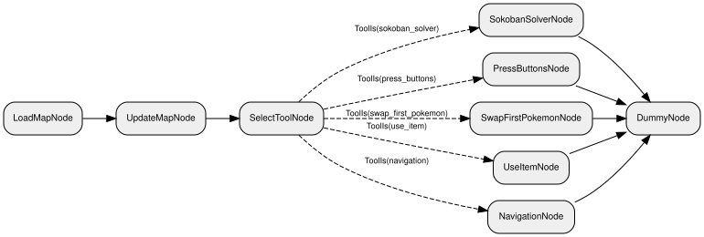
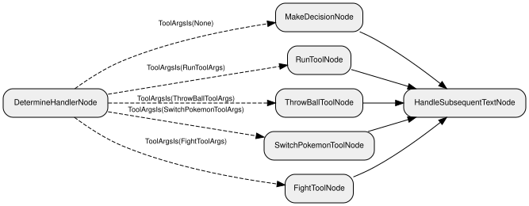
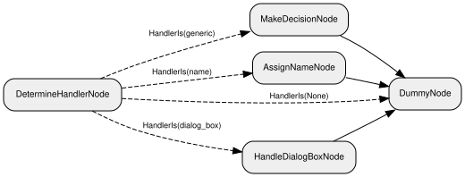

# AI Workflow: Node-by-Node Analysis

This page walks through the entire Junjo workflow, one node at a time. You might want to [familiarize yourself with the design of the project](/docs/philosophy.md) before diving into this, as some of that terminology will be used here. At a high level, we have an entrypoint for the agent that handles memory updates and retrieval, setting goals, and routing the flow to one of three dedicated subflows, each of which handles a major aspect of playing Pokémon. The three subflows are the Overworld Handler, the Battle Handler, and the Text Handler, and each one has its own suite of tools to operate in its domain.

Note: Pretty much all the constants below are default values that can be edited in [`common/constants.py`](/common/constants.py).

## The Main Agent Graph

### Prepare Agent Store

This is the entrypoint for the entire AI workflow. It is responsible for taking the previous agent state and preparing for the next iteration of the loop. It loads the current rolling-memory summary frontier and exact raw tail from SQLite, creates the next mutable iteration block when necessary, increments certain counters, waits for any in-game animations to finish, and determines which subflow the workflow will route to depending on whether the current game state is in a battle, free to move in the overworld, or reading dialog/menu text.

### Create/Update Long-Term Memory

These are two nodes that run in parallel if the Prepare Agent Store node determines that a refresh of the long-term memory is required. They do exactly what their names suggest: One creates new long-term memory objects in the database, and the other updates and edits the ones that are currently in memory.

### Retrieve Long-Term Memory

This is the node that pulls long-term memories from the database. The model sees the available memory titles alongside the current game and agent state, then selects up to 10 titles to recall. The selected documents are loaded directly by title and added to the agent state until the next retrieval iteration.

### Dummy Node

This is purely topological to simplify the flow of the graph. It does nothing.

### The Three Subflows

At this point, the flow is diverted into one of the three subflows. Each of these is treated fully below.

### Do Updates

This is another collection of parallel nodes:

- Update Goals: Optionally sets/edits/completes the AI's goals
- Update Background Stream: Updates the live background for streaming at `localhost:8080` with the latest information from the workflow and game states

### Finalize Memory

This is the final node in every successful top-level workflow. It writes the completed iteration's combined memory block to SQLite exactly once, then performs one hierarchical compaction pass. Raw blocks remain in the database permanently; compaction only adds derived summaries. The next workflow initializes the new current block and reloads the resulting bounded memory view.

Outside the graph, the application captures the emulator state and creates a backup every 20 minutes, as well as after a caught workflow error. The copied SQLite database contains the complete finalized memory history, while the serialized agent state contains only its current in-memory block. Initialization recognizes a block that has already been finalized and advances to the next iteration without duplicating it.

## The Overworld Handler Subflow

### Load Map

This is the entrypoint for the overworld handler. It loads the current map from the database into the agent state, or creates a new one if we've just entered a new map.

### Update Map

This uses the current visible screen information to update the map memory in the database. It updates the tiles, revealing any formerly unseen tiles that are now visible, and adds on-screen sprites/signs/warps to the map entity database table.

### Select Tool

This is the main decision maker in the overworld subflow. It looks at the game state and the various memory objects and selects which tool the AI should use for this iteration. The tools are all described in detail below. The current iteration's memory "thought" created in this node is continued by whichever tool is selected.

### Press Buttons

This is the simplest of all the overworld tools, and it does exactly what it says: It allows the AI to enter one or more button presses directly into the emulator. Its main use case is for interacting with an adjacent entity using the A button, but it can also be used to rotate the player in place, open the start menu, or walk a few steps, though the AI is strongly discouraged from using this tool to navigate around the map. This is partly because it's a waste of tokens to move this way when the navigation tool is available, but largely because it has awful spatial reasoning and cannot be trusted to move around effectively on its own.

### Navigation

This is the main tool used for navigating the overworld, and also the most complex node in the entire workflow. The AI is given a list of accessible tiles, as well as some good candidates for further exploring the map, and it tells the tool where it wants to go. The destination is checked to make sure it's legal, and an A* algorithm then finds the shortest path and starts walking there. Every step, it checks for interruptions and updates the map. The navigation algorithm is sophisticated enough to handle ledges, surfing, cut trees, Team Rocket spinner tiles, and elevation changes in caverns.

### Use Item

Allows the AI to select an item from its bag and attempt to use it.

### Swap First Pokémon

This lets the model swap its first Pokémon with another Pokémon in the party. It is useful for training specific Pokémon, or for leading with certain Pokémon before major battles.

### Sokoban Solver

This was my least favourite node to code because it is so complicated and we only need it in two areas, one of which is optional. "Sokoban" puzzles, named for the classic Japanese video game that popularized them, are the style of puzzles that appear in Pokémon as the boulder pushing puzzles in Victory Road and the Seafoam Islands. There is no way that the AI is solving these on its own, so we need an algorithm to do it. This category of problems is technically NP-hard, but thankfully the ones found in-game are simple enough to be solved quickly with A* search.

### Dummy Node

Purely topological, as are all dummy nodes in the workflow. This is the sink node the signals the end of the overworld subflow.

## The Battle Handler Subflow

### Determine Handler

This is the entrypoint for the battle handler subflow. Its job is to determine which tool to route the flow to. It first checks for anything unusual. If we're in an irregular battle type (tutorial or safari zone), or the Fight/Item/PKMN/Run menu isn't open, it will immediately route to the generic "make decision" node. Otherwise, it will determine the legal decisons available based on the game state and ask the AI to select one of them.

### Make Decision

This is the generic handler for all unusual situations. It is very similar to the "press buttons" tool in the overworld. If we're in any battle that is not a standard wild Pokémon or trainer battle, or if the fight menu didn't open properly (e.g. because our Pokémon fainted), this tool will select one or more buttons to enter directly into the emulator.

### Fight Tool

Enters deterministic button presses to use one of the current Pokémon's available moves.

### Switch Pokémon Tool

Only available if the player has more than one Pokémon with non-zero HP. Enters deterministic button presses to switch to another Pokémon in the party.

### Throw Ball Tool

Only available in wild battles if the player has balls in their inventory. Enters deterministic button presses to throw one of the balls.

### Run Tool

Only available in wild battles. Runs from the battle.

### Handle Subsequent Text

The final node in the battle handler. It may surprise you that we do this here instead of in the text handler, but it's because the logic for reading text in a battle is slightly different from doing so in the overworld. Additionally, the text starts streaming the moment an action is taken, so we don't have time to wait for the next iteration to start. This node captures any text that streams and appends it to the current iteration's memory block.

## The Text Handler Subflow

### Determine Handler

This is the entrypoint of the text handler subflow, and its job is to determine which of the available tools is most appropriate for handling the current game state. This subflow, unlike the others, has the option to bail immediately if it detects that there is no text on the screen. This is because some dialog boxes in the game close themselves, and they may do so between the handler being set and the subflow starting.

### Handle Dialog Box

This is the most common tool in the text handler subflow. Its job is to read through any dialog that appears on screen and append it directly to the current iteration's memory block. This saves us a ton of time and tokens by pulling the text straight from the game state instead of making the AI read it screenshot by screenshot. This node exits if either the dialog box disappears, or if text appears outside the dialog box indicating that a menu has opened up.

### Assign Name

A niche tool, but a very useful one. This enters a name into the game when the player is asked for their name at the start of the game or captures a new Pokémon and gives it a nickname. Like the dialog box handler, this saves us a ton of time and tokens by asking the AI for a name and deterministically entering the button presses required to submit that name, rather than getting the AI to do it one button at a time. The AI is also really bad at entering names manually, so this saves us from watching it play with a team full of Pokémon named "AAAAAAAAAA".

### Make Decision

The generic decision maker node for the text handler. Like the node of the same name from the battle handler, this one is effectively a "push buttons" tool. It is used to handle menu navigation, yes/no questions, and any other non-trivial text interactions.

### Dummy Node

Purely topological sink node for the subflow.
