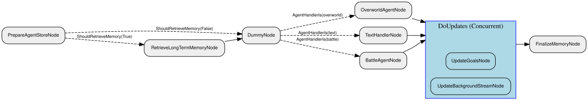
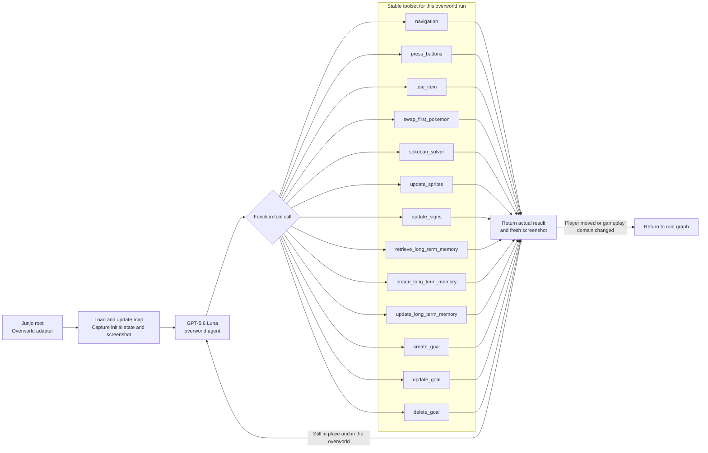
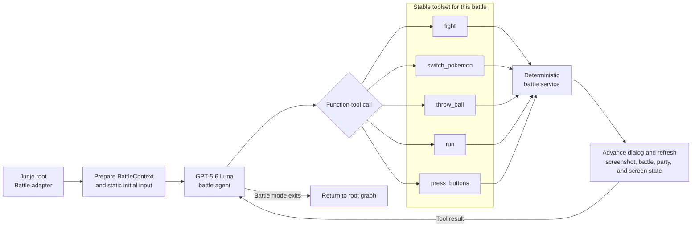
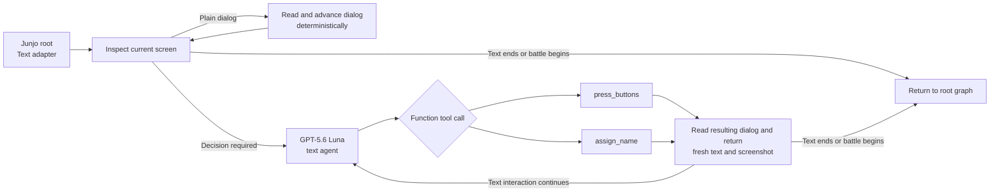

# AI Workflow Architecture

This page describes the current hybrid workflow. You might want to [familiarize yourself with the design of the project](/docs/philosophy.md) before diving in, as some of that terminology is used here. A small Junjo root prepares shared state, routes to one of three gameplay domains, refreshes the display, and finalizes rolling memory. Each domain runs locally through a Pydantic AI agent reached through a root adapter node.

Note: Pretty much all the constants below are default values that can be edited in [`common/constants.py`](/common/constants.py).

## The Junjo Root Graph

### Prepare Agent Store

This is the entrypoint for the entire AI workflow. It is responsible for taking the previous agent state and preparing for the next iteration of the loop. It loads the current rolling-memory summary frontier and exact raw tail from SQLite, creates the next mutable iteration block when necessary, clears the loaded long-term-memory context when the iteration advances, waits for any in-game animations to finish, and determines which subflow the workflow will route to depending on whether the current game state is in a battle, free to move in the overworld, or reading dialog/menu text.

### The Three Gameplay Domains

At this point, the flow is diverted into one of the three gameplay domains. Each adapter invokes its domain's complete local runner and returns control when that runner reaches its boundary.

### Update Background Stream

After the selected gameplay domain returns, this node refreshes the live background for streaming at `localhost:8080` with the latest workflow and game state. Goal and long-term-memory management now belong to the overworld agent rather than periodic root model calls.

### Finalize Memory

This is the final node in every successful top-level workflow. It writes the completed iteration's combined memory block to SQLite exactly once, then performs one hierarchical compaction pass. Raw blocks remain in the database permanently; compaction only adds derived summaries. The next workflow initializes the new current block and reloads the resulting bounded memory view.

Outside the graph, the application captures the emulator state and creates a backup every 20 minutes, as well as after a caught workflow error. The copied SQLite database contains the complete finalized memory history, while the serialized agent state contains only its current in-memory block. Initialization recognizes a block that has already been finalized and advances to the next iteration without duplicating it.

## The Overworld Agent

The overworld handler prepares the explored map and then gives one Pydantic AI agent the local navigation loop. The runner returns to the root workflow as soon as a tool moves the player or the game enters another gameplay domain.

```mermaid
flowchart LR
    root["Junjo root<br/>Overworld adapter"] --> prepare["Load and update map<br/>Capture initial state and screenshot"]
    prepare --> agent["GPT-5.6 Luna<br/>overworld agent"]
    agent --> choice{"Function tool call"}

    subgraph toolset["Stable toolset for this overworld run"]
        navigate["navigation"]
        buttons["press_buttons"]
        item["use_item"]
        swap["swap_first_pokemon"]
        sokoban["sokoban_solver"]
        sprites["update_sprites"]
        signs["update_signs"]
        retrieve_memory["retrieve_long_term_memory"]
        create_memory["create_long_term_memory"]
        update_memory["update_long_term_memory"]
        create_goal["create_goal"]
        update_goal["update_goal"]
        delete_goal["delete_goal"]
    end

    choice --> navigate
    choice --> buttons
    choice --> item
    choice --> swap
    choice --> sokoban
    choice --> sprites
    choice --> signs
    choice --> retrieve_memory
    choice --> create_memory
    choice --> update_memory
    choice --> create_goal
    choice --> update_goal
    choice --> delete_goal

    navigate --> observe["Return actual result<br/>and fresh screenshot"]
    buttons --> observe
    item --> observe
    swap --> observe
    sokoban --> observe
    sprites --> observe
    signs --> observe
    retrieve_memory --> observe
    create_memory --> observe
    update_memory --> observe
    create_goal --> observe
    update_goal --> observe
    delete_goal --> observe

    observe -->|"Still in place and in the overworld"| agent
    observe -->|"Player moved or gameplay domain changed"| finish["Return to root graph"]
```

### Prepare Context

Before constructing the agent, deterministic preparation loads the current explored map from SQLite or creates it when entering a new map. The current visible screen reveals terrain and synchronizes sprites, signs, and warps. Preparation also loads every existing long-term-memory title so retrieval can select documents directly and creation can avoid duplicates. The prepared context, initial game state, and screenshot are then used to build one static prompt and tool registry for the run.

The prompt includes rolling and currently loaded long-term memory, every available long-term-memory title, goals, player and party state, inventory indices, the explored map, accessible coordinates, exploration candidates, and connected-map boundaries.

Tool availability is derived once from the prepared state:

- `press_buttons`, the three goal lifecycle tools, `create_long_term_memory`, and `update_long_term_memory` are always available;
- `retrieve_long_term_memory` requires at least one existing memory title;
- `navigation` is unavailable while biking;
- `swap_first_pokemon` requires more than one party member;
- `use_item` requires a non-empty inventory;
- `sokoban_solver` requires a visible boulder and goal plus access to Strength; and
- sprite and sign updates require an eligible entity within two tiles.

Keeping the registry fixed preserves prompt caching. Actions that depend on changing game state validate what they need immediately before acting rather than rebuilding the tool definitions during the run.

### Press Buttons

This is the simplest of all the overworld tools, and it does exactly what it says: It allows the AI to enter one or more button presses directly into the emulator. Its main use case is for interacting with an adjacent entity using the A button, but it can also be used to rotate the player in place, open the start menu, or walk a few steps, though the AI is strongly discouraged from using this tool to navigate around the map. This is partly because it's a waste of tokens to move this way when the navigation tool is available, but largely because it has awful spatial reasoning and cannot be trusted to move around effectively on its own.

### Navigation

This is the main tool used for navigating the overworld, and also the most complex node in the entire workflow. The AI is given a list of accessible tiles, as well as some good candidates for further exploring the map, and it tells the tool where it wants to go. The destination is checked to make sure it's legal, and an A* algorithm then finds the shortest path and starts walking there. Every step, it checks for interruptions and updates the map. The navigation algorithm is sophisticated enough to handle ledges, surfing, cut trees, Team Rocket spinner tiles, and elevation changes in caverns.

### Use Item

Allows the AI to select an item from its bag and attempt to use it.

### Swap First Pokémon

This lets the model swap its first Pokémon with another Pokémon in the party. It is useful for training specific Pokémon, or for leading with certain Pokémon before major battles.

### Sokoban Solver

This was my least favourite tool to code because it is so complicated and we only need it in two areas, one of which is optional. "Sokoban" puzzles, named for the classic Japanese video game that popularized them, are the style of puzzles that appear in Pokémon as the boulder pushing puzzles in Victory Road and the Seafoam Islands. There is no way that the AI is solving these on its own, so we need an algorithm to do it. This category of problems is technically NP-hard, but thankfully the ones found in-game are simple enough to be solved quickly with a bounded search.

### Update Sprites and Signs

These tools let the agent persist useful descriptions of nearby map entities after learning something new about them. The model can update only the sprites or signs exposed by the fixed tool definition at the start of the run; the service persists accepted descriptions through the map-entity repository.

### Retrieve, Create, and Update Long-Term Memory

These tools let the overworld agent manage concise documents that remain useful far beyond the current interaction. Each call retrieves, creates, or updates exactly one document. Retrieval selects one document directly from the available titles, appends it to the loaded context for the current iteration, and returns it to the active conversation; it is omitted from the fixed registry when the mode-entry title list is empty. Creation checks the complete title list for duplicates, while updates are restricted to loaded memories. A newly created memory is added to both sets immediately and reported in the tool response, so fixed retrieval and update tools can use it later in the same conversation when retrieval was available at mode entry. Each successful call updates live agent state without ending the overworld run, and writes go through the long-term-memory repository.

### Create, Update, and Delete Goals

Three tools give the overworld agent distinct one-goal-at-a-time lifecycle operations. Creation carries the detailed priority, SMART-goal, distinctness, relevance, and evidence guidance for choosing a new objective. Updating revises the text or priority of a goal that is still being pursued. Deleting covers both completing a goal and deciding not to chase it anymore. Every accepted change uses the existing goal collection behavior, updates authoritative live goal state immediately, and returns the complete revised list to the active conversation without copying it into rolling memory. Goal management is discretionary rather than scheduled: when the current goals remain appropriate, the agent uses another tool instead.

### Memory and Display Updates

The agent narrates its decision alongside each tool call. The tool then produces the actual outcome of the action. Action and long-term-memory mutation outcomes are appended to the current rolling-memory block and returned with a fresh screenshot to the local conversation, so the HTML activity log and the agent cannot disagree about what happened. Retrieval returns the durable document directly and appends it to the iteration-scoped long-term-memory set without copying its content into rolling memory. Goal tools likewise return their result directly and update authoritative goal state without copying the result into rolling memory.

If the action leaves the player in place and the game in the overworld, the agent can make another decision using that result. Once the player moves or the game enters a text interaction or battle, the runner returns to the root graph. The complete overworld run remains one top-level workflow iteration.

## The Battle Agent

The battle handler is a Pydantic AI agent that owns the complete battle lifecycle. A root adapter prepares its typed `BattleContext` and static initial input, then hands over control until the battle ends.

```mermaid
flowchart LR
    root["Junjo root<br/>Battle adapter"] --> prepare["Prepare BattleContext<br/>and static initial input"]
    prepare --> agent["GPT-5.6 Luna<br/>battle agent"]
    agent --> choice{"Function tool call"}

    subgraph toolset["Stable toolset for this battle"]
        fight["fight"]
        switch["switch_pokemon"]
        ball["throw_ball"]
        run["run"]
        buttons["press_buttons"]
    end

    choice --> fight
    choice --> switch
    choice --> ball
    choice --> run
    choice --> buttons

    fight --> service["Deterministic<br/>battle service"]
    switch --> service
    ball --> service
    run --> service
    buttons --> service

    service --> observe["Advance dialog and refresh<br/>screenshot, battle, party, and screen state"]
    observe -->|"Tool result"| agent
    agent -->|"Battle mode exits"| finish["Return to root graph"]
```

The initial prompt, memory, goals, and tool definitions are prepared once. After every action, the tool returns a fresh screenshot and parsed observation to the same conversation. The agent can therefore react to damage, fainted Pokémon, failed escape attempts, new opponents, forced switches, and irregular battle screens without returning to the root graph or rebuilding its context.

The registry is fixed for the battle type so the model-visible prompt remains stable and cache-friendly:

| Tool | Trainer battle | Wild battle | Other battle |
|---|:---:|:---:|:---:|
| `fight` | ✓ | ✓ | — |
| `switch_pokemon` | ✓ | ✓ | — |
| `throw_ball` | — | ✓ | — |
| `run` | — | ✓ | — |
| `press_buttons` | ✓ | ✓ | ✓ |

Temporary legality is deliberately not encoded by rebuilding the registry. Each tool reads fresh emulator state immediately before acting. If a move has no PP, a party member has fainted, or a requested ball is no longer in the bag, the tool rejects the request and gives the agent the updated observation so it can try something else.

### Fight

Selects a move by its zero-based slot. The deterministic service navigates the battle menu, uses the move, captures every page of the resulting dialog, and waits for the next decision point.

### Switch Pokémon

Selects a party member by its zero-based slot. The tool validates that the Pokémon is alive and not already active before deterministically navigating the party menu.

### Throw Ball

Selects a Poké Ball by type during a wild battle. The tool checks the current inventory, throws the requested ball, and returns the resulting dialog and screen state. A successful catch exits the battle loop so the root workflow can route the naming screen to the text handler.

### Run

Attempts to escape from a wild battle. A failed escape returns the opponent's response and refreshed battle state to the agent so it can make another decision.

### Press Buttons

Provides constrained directional, confirm, and cancel input for forced switches, dialog, special battle types, and other screens that do not fit one of the semantic tools. It remains available during ordinary battles because those irregular screens can appear at any time.

### Memory and Display Updates

The agent emits a brief explanation alongside each tool call. That explanation and captured in-game dialog are appended to the current rolling-memory block and streamed to the HTML activity log. Detailed action results and refreshed observations stay inside the agent conversation, where they provide context for the next decision without flooding durable memory. The complete battle remains one top-level workflow iteration.

## The Text Runner

The text handler owns an entire interaction inside one local runner reached through a root adapter. The important distinction here is that most text in Pokémon does not require any actual decision-making. We should not pay an AI to mash A through a speech bubble when we can read the text directly from memory and advance it ourselves.

```mermaid
flowchart LR
    root["Junjo root<br/>Text adapter"] --> inspect["Inspect current screen"]
    inspect -->|"Plain dialog"| dialog["Read and advance dialog<br/>deterministically"]
    dialog --> inspect
    inspect -->|"Decision required"| agent["GPT-5.6 Luna<br/>text agent"]
    inspect -->|"Text ends or battle begins"| finish["Return to root graph"]

    agent --> choice{"Function tool call"}
    choice --> buttons["press_buttons"]
    choice --> name["assign_name"]
    buttons --> observe["Read resulting dialog and return<br/>fresh text and screenshot"]
    name --> observe
    observe -->|"Text interaction continues"| agent
    observe -->|"Text ends or battle begins"| finish
```

### Handle Dialog Box

This is the most common path through the text handler, and it is deliberately handled before the agent is even constructed. Its job is to read through any dialog that appears on screen and append it directly to the current iteration's memory block. This saves us a ton of time and tokens by pulling the text straight from the game state instead of making the AI read it screenshot by screenshot.

The dialog reader exits if the box disappears, a battle begins, or text appears outside the dialog box. That last case usually means that a menu or yes/no question has opened and a real decision is finally required. If the dialog simply closes, the runner returns without making a model call at all. If it reveals a decision, the runner starts one text-agent conversation and keeps it alive until the interaction is over.

### Press Buttons

This is the generic decision maker for the text handler. It is effectively a constrained "push buttons" tool used for menu navigation, yes/no questions, the title screen, and any other non-trivial text interaction.

After the buttons are pressed, deterministic code reads and advances any resulting dialog. The tool then returns the captured text, current onscreen text, and a fresh screenshot to the same agent conversation. This lets the model make several related decisions without repeatedly backing out through the entire root graph.

### Assign Name

A niche tool, but a very useful one. This enters a name into the game when the player is asked for their name at the start of the game, when the rival needs a name, or when a newly caught Pokémon needs a nickname. It saves time and tokens by asking the AI for a name and deterministically entering the button presses required to submit it, rather than getting the AI to do it one button at a time.

The tool checks that the naming screen is actually open before doing anything. If it is not, the request is rejected and the current text and screenshot are returned so the agent can recover.

### Memory and Display Updates

The agent narrates each decision alongside its tool call. That explanation and any dialog read after the action are appended to the current rolling-memory block and streamed to the HTML activity log. The more mechanical tool results stay inside the local conversation, where they are useful for the next decision without cluttering long-term history. The complete text interaction counts as one top-level workflow iteration.
