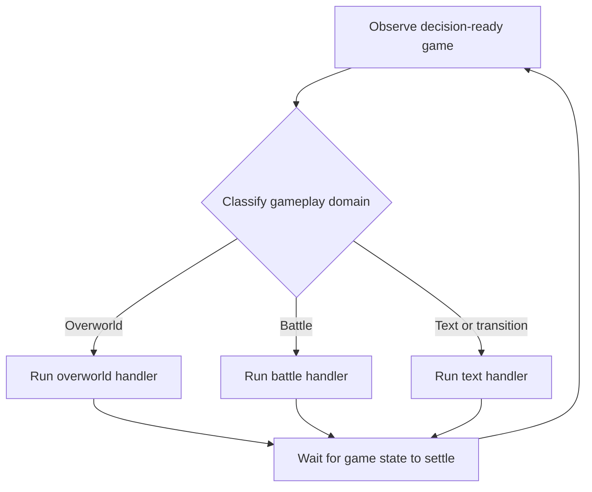
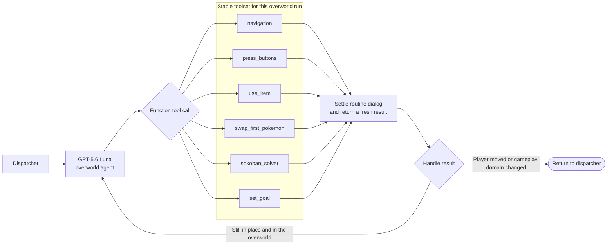
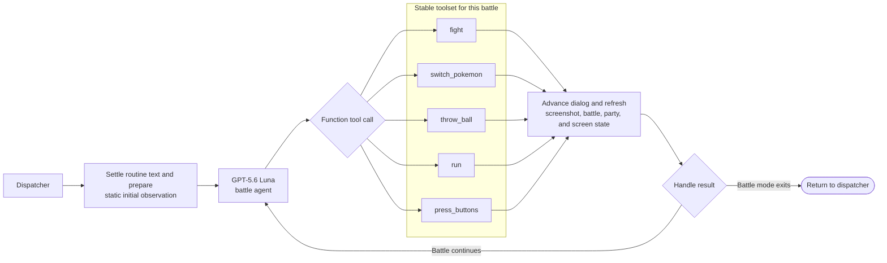
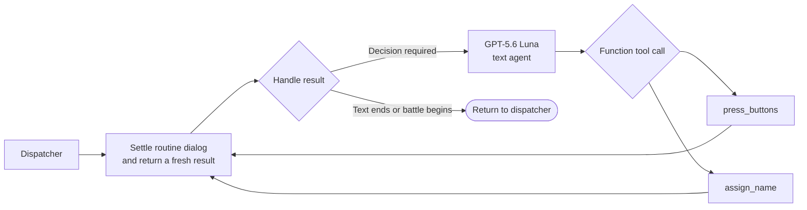

# AI Workflow

This page walks through the entire AI workflow, one part at a time. You might want to [familiarize yourself with the design of the project](/docs/philosophy.md) before diving in, as some of that terminology will be used here. At a high level, we have an entrypoint that looks at the current game state and routes control to one of three dedicated handlers: the Overworld Handler, the Battle Handler, or the Text Handler. Each handler has its own agent and its own suite of tools for operating in that part of the game.

## The Main Agent Loop

```mermaid
flowchart TD
    observe[Observe decision-ready game] --> classify{Classify gameplay domain}
    classify -->|Overworld| overworld[Run overworld handler]
    classify -->|Battle| battle[Run battle handler]
    classify -->|Text or transition| text[Run text handler]
    overworld --> settle[Wait for game state to settle]
    battle --> settle
    text --> settle
    settle --> observe
```

### Select Handler

This is the entrypoint for the workflow. It waits until the game is ready for input, reads the current game state, and decides which handler should take over. Battles go to the Battle Handler; dialog and menus go to the Text Handler, and everything else goes to the Overworld Handler. The same shared agent state is maintained in every trip through this loop. This is where we keep the rolling memory, goals, iteration count, token usage, and other information that needs to flow from one handler to the next.

### Iterations and Memory

An iteration is one meaningful decision or recorded outcome. The model explains what it intends to do, the selected tool carries out the action, and the result is added to the rolling memory. The model's decisions are also sent to the public log, while routine action results and dialogue remain only in its memory. Each handler can make several related decisions while keeping the same conversation alive (e.g. multiple turns in a battle). This lets the agent react to the result of an action without rebuilding its entire context every time. Once the current handler concludes, control returns to the main loop, the game state is checked again, and the loop repeats.

### Backups

The application saves a backup every 10 minutes. Each backup contains the emulator state, the live agent state, and a copy of the database, which together are enough to resume the run. If the workflow fails unexpectedly, it attempts to create one final backup before shutting down.

## The Overworld Handler

The Overworld Handler is responsible for exploring maps, interacting with the world, managing the party outside battle, and deciding where to go next.

```mermaid
flowchart LR
    dispatch["Dispatcher"] --> agent["GPT-5.6 Luna<br/>overworld agent"]
    agent --> choice{"Function tool call"}

    subgraph toolset["Stable toolset for this overworld run"]
        navigate["navigation"]
        buttons["press_buttons"]
        item["use_item"]
        swap["swap_first_pokemon"]
        sokoban["sokoban_solver"]
        set_goal["set_goal"]
    end

    choice --> navigate
    choice --> buttons
    choice --> item
    choice --> swap
    choice --> sokoban
    choice --> set_goal

    navigate --> settle["Settle routine dialog<br/>and return a fresh result"]
    buttons --> settle
    item --> settle
    swap --> settle
    sokoban --> settle
    set_goal --> settle

    settle --> continue{"Handle result"}
    continue -->|"Still in place and in the overworld"| agent
    continue -->|"Player moved or gameplay domain changed"| finish(["Return to dispatcher"])
```

### Prepare Map

This is the entrypoint for the Overworld Handler. It loads the current map from the database, or creates it if the agent has just entered the map, and updates it with everything visible on the current screen. The map given to the agent contains the terrain it has discovered, together with known sprites, signs, objects, and warps. To avoid confusing separate parts of the same map, it shows only the connected region the player currently occupies. It also shows reachable boundaries leading to neighboring maps, so the agent can still plan beyond the current region without being handed a giant world map.

### Overworld Tools

Once the map and game state are prepared, the overworld agent chooses from the six tools described below. The available tools depend on the current game state: For example, there is no reason to offer the item tool when the bag is empty, or the Sokoban solver when there is no boulder puzzle in sight. If the action leaves the player in the same place and still in the overworld, the result goes back to the same conversation so the agent can try something else. If the player moves or the game enters another part of the workflow, control returns to the main loop.

#### Press Buttons

This allows the AI to enter one or more button presses directly into the emulator. Its main use case is interacting with something using the A button, but it can also rotate the player in place, open the start menu, or walk a few steps. The AI is strongly discouraged from using this tool for ordinary navigation, partly because it wastes tokens but largely because its spatial reasoning is terrible.

#### Navigation

This is the main tool used for navigating the overworld. The AI chooses a destination from the explored map, and the tool checks whether that destination is actually reachable. An A* search algorithm then finds the shortest path and starts walking there. Every step, it checks for interruptions and updates the map with anything newly discovered. The navigation algorithm is sophisticated enough to handle ledges, surfing, cut trees, Team Rocket spinner tiles, and elevation changes in caverns.

#### Use Item

This allows the AI to select an item from its bag and attempt to use it.

#### Swap First Pokémon

This lets the model swap its first Pokémon with another Pokémon in the party. It is useful for training specific Pokémon or leading with a particular Pokémon before a major battle.

#### Sokoban Solver

This was my least favourite tool to code because it is so complicated and we only need it in two areas, one of which is optional. "Sokoban" puzzles, named for the classic Japanese video game that popularized them, are the proper name for the boulder-pushing puzzles in Victory Road and the Seafoam Islands. Watching the AI struggle through them itself would be a nightmare, so we solve them automatically with a bounded search. This problem is NP-hard in general, but the puzzles found in-game are simple enough for us to brute force quickly.

#### Set Goal

This tool lets the agent add, replace, or remove one of its longer-term goals. The agent is free to leave the list alone when its existing goals are still useful.

### Handle Result

After the tool finishes, its result is added to the rolling memory and returned to the agent with a fresh screenshot. Any ordinary dialog caused by the action is read and advanced automatically. The complete dialog is returned to the agent and, when possible, attached to the sprite, sign, or object that produced it. If the player is still standing in the same place after all of that, the same agent can choose another tool. Menus and other decision screens are left alone for the appropriate handler.

## The Battle Handler

The Battle Handler takes over for an entire battle. It gives the agent the current battle state and a set of tools appropriate to the type of battle, then keeps the same conversation alive until the battle ends.

```mermaid
flowchart LR
    dispatch["Dispatcher"] --> prepare["Settle routine text and prepare<br/>static initial observation"]
    prepare --> agent["GPT-5.6 Luna<br/>battle agent"]
    agent --> choice{"Function tool call"}

    subgraph toolset["Stable toolset for this battle"]
        fight["fight"]
        switch["switch_pokemon"]
        ball["throw_ball"]
        run["run"]
        buttons["press_buttons"]
    end

    choice --> fight
    choice --> switch
    choice --> ball
    choice --> run
    choice --> buttons

    fight --> observe["Advance dialog and refresh<br/>screenshot, battle, party, and screen state"]
    switch --> observe
    ball --> observe
    run --> observe
    buttons --> observe
    observe --> handle{"Handle result"}
    handle -->|"Battle continues"| agent
    handle -->|"Battle mode exits"| finish(["Return to dispatcher"])
```

The available tools depend on the type of battle:

| Tool | Trainer battle | Wild battle | Other battle (e.g. Safari)     |
|---|:---:|:---:|:---:|
| `fight` | ✓ | ✓ | — |
| `switch_pokemon` | ✓ | ✓ | — |
| `throw_ball` | — | ✓ | — |
| `run` | — | ✓ | — |
| `press_buttons` | ✓ | ✓ | ✓ |

Each tool checks the current game state before acting. If a move has no PP, a party member has fainted, or the requested ball is no longer in the bag, the tool rejects the request and lets the agent choose something else.

### Fight

Uses one of the current Pokémon's available moves. The tool enters the necessary button presses, reads the resulting dialog, and waits until the next battle decision.

### Switch Pokémon

Switches to another living Pokémon in the party. The tool checks that the requested Pokémon can actually be used before navigating the party menu.

### Throw Ball

Throws one of the available Poké Balls during a wild battle. If the Pokémon is caught, the Battle Handler exits so the Text Handler can deal with the naming screen.

### Run

Attempts to escape from a wild battle. If the attempt fails, the opponent's response and the new battle state go back to the same agent so it can make another decision.

### Press Buttons

This is the generic tool for battle screens that do not fit one of the options above. It handles forced switches, unusual battle types, and any other situation where the agent needs to operate the menu directly.

### Handle Subsequent Text

After every action, the resulting battle text and updated game state are returned to the agent so it can decide what to do next. This stays inside the Battle Handler because the text begins as soon as the action is taken, and because the next decision usually depends on what just happened. Once the battle ends, control returns to the main loop.

## The Text Handler

The Text Handler is responsible for dialog, menus, naming screens, and other interactions that take control away from the overworld. The important distinction here is that most text in Pokémon does not require any actual decision-making. We should not pay an AI to mash A through a speech bubble when we can read the text directly from the game and advance it ourselves.

```mermaid
flowchart LR
    dispatch["Dispatcher"] --> settle["Settle routine dialog<br/>and return a fresh result"]
    settle --> handle{"Handle result"}
    handle -->|"Decision required"| agent["GPT-5.6 Luna<br/>text agent"]
    handle -->|"Text ends or battle begins"| finish(["Return to dispatcher"])

    agent --> choice{"Function tool call"}
    choice --> buttons["press_buttons"]
    choice --> name["assign_name"]
    buttons --> settle
    name --> settle
```

### Handle Dialog Box

This is the most common path through the Text Handler. It reads completed dialog directly from the game, advances the text, and adds the transcript to the rolling memory. It continues until the dialog ends or the game reaches a screen where the agent has to make a real decision. If the entire interaction is ordinary dialog, the handler returns to the main loop without calling the model at all. If a menu, question, or other decision remains, it starts the text agent and gives it the current text and screenshot.

### Press Buttons

This is the generic decision-making tool for the Text Handler. It is used for menu navigation, yes/no questions, the title screen, and any other non-trivial text interaction. After the buttons are pressed, any resulting dialog is read automatically and returned to the same conversation. The agent can therefore make several related decisions without starting over each time.

### Assign Name

A niche tool, but a very useful one. This enters a name when the player or rival needs one at the start of the game, or when a newly caught Pokémon needs a nickname. It saves time and tokens by asking the AI for a name and entering it deterministically, rather than getting the AI to move around the keyboard one button at a time. The AI is also terrible at entering names manually, so this saves us from watching it play with a team full of Pokémon named "AAAAAAAAAA".
